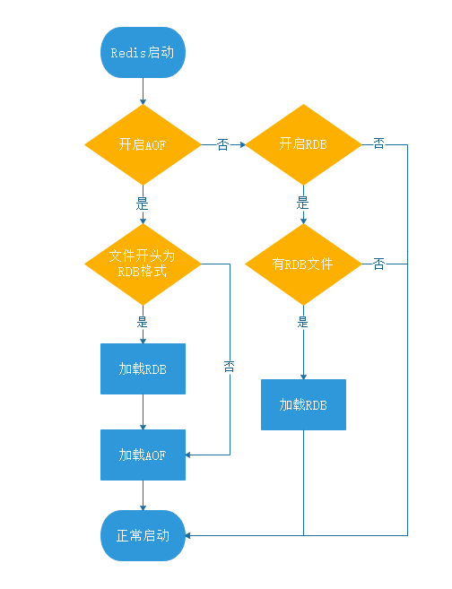

RBD和AOF的对比
---

RBD和AOF的选择
---

    系统是愿意牺牲一些性能，换取更高的缓存一致性（aof），

    还是愿意写操作频繁的时候，不启用备份来换取更高的性能，

    待手动运行save的时候，再做备份（rdb)

如果redis中同时使用了rdb和aof，重启时恢复以aof，因为aof数据更完整

rbd更多的是数据备份

混合持久化
---

Redis 5.0 默认值为 yes

redis.conf

    aof-use-rdb-preamble no

混合持久化的加载流程如下

判断是否开启 AOF 持久化，开启继续执行后续流程，未开启执行加载 RDB 文件的流程；

判断 appendonly.aof 文件是否存在，文件存在则执行后续流程；

判断 AOF 文件开头是 RDB 的格式, 先加载 RDB 内容再加载剩余的 AOF 内容；

判断 AOF 文件开头不是 RDB 的格式，直接以 AOF 格式加载整个文件。

持久化最佳方案
---

持久化开发 关闭 数据丢失不敏感 关闭持久化

主从部署 一个响应主业务， 一个用于数据持久化

使用混合持久化

使用配置更高的机器（更多的内存和更快的磁盘）

慢查询
---

slowlog-log-slower-than : 慢查询阈值，单位是微秒 默认10000  就是10毫秒

slowlog-max-len : 慢查询日志长度，默认128，建议1000

