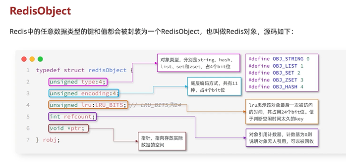
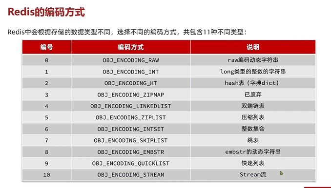
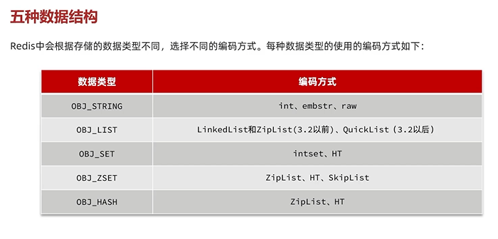

redis object
---

    type 对象类型 分别是string hash list set zset 4个bit

    encoding 底层编码方式 4个bit

    lru 最后一次被访问的时间 24个bit

    refcount 对象引用计数器 

    ptr 指针 指向存放实际数据的空间  

redis的编码方式
---

五种数据结构使用的编码方式

string 

    int embstr raw

list

    3.2前 linkedlist, ziplist   3.2后 quicklist 

set

    intset hashtable

zset

    ziplist hashtable skiptable

hash

    ziplist hashtable

