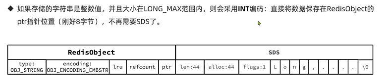

String
---

三种编码方式

    SDS embstr int

基本编码方式是raw,基于简单动态字符串SDS实现，存储上限为512MB

如果存储的SDS长度小于44字节，则会采用embstr编码 此时 object head 和 SDS就是一段连续空间，

申请内存只会调用一次内存分配函数 效率更高 不需要指针寻址

如果是整数型 且大小在long_max（8字节）范围内，则会采用int编码

直接保存在ptr指针位置（这个ptr指针也是8字节） 不再需要SDS

总结
---