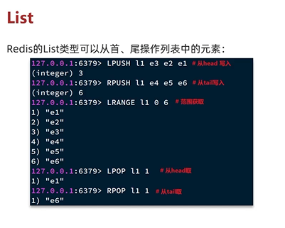
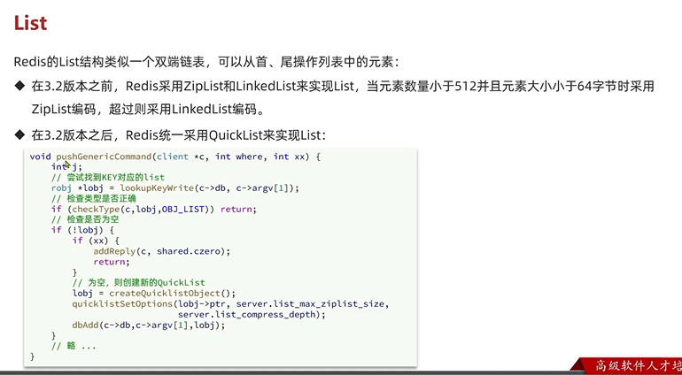
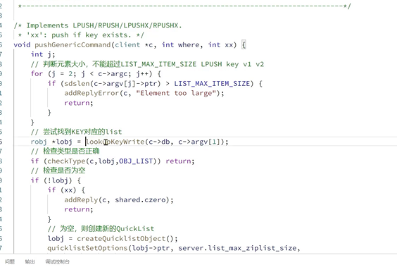
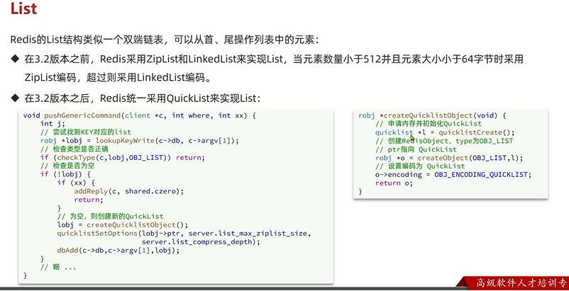
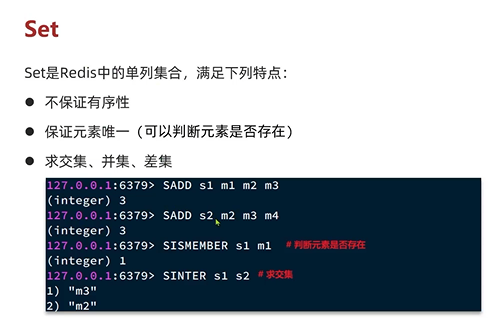

List
---

适合首位操作

在3.2前 当元素数量小于512个并且元素大小不超过62字节时采用ZipList,超过则采用LinkedList

从3.2开始 统一采用QuickList来实现List

 

Set
---

无序 唯一 交集 并集 差集 

实现如共同好友功能（SINTER 求交集）

使用hashTable（dict）来实现 

如果数据都是整数，且数量不超过 `set-max-intset-entries` 配置的值(默认512)，set会采用IntSet编码，节省内存
为什么不用skip list?

    跳表是有序的 set不需要有序 且 跳表使用数字做排序字段 set里面不一定是数字

dict中的key来存储元素，value统一为null

