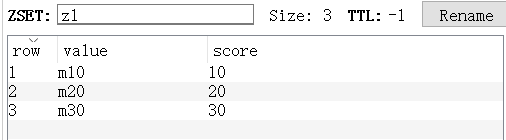
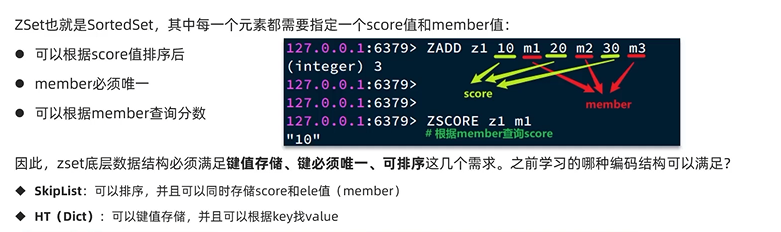
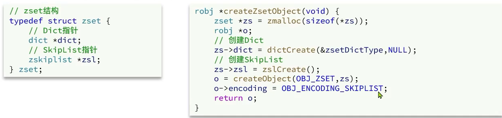
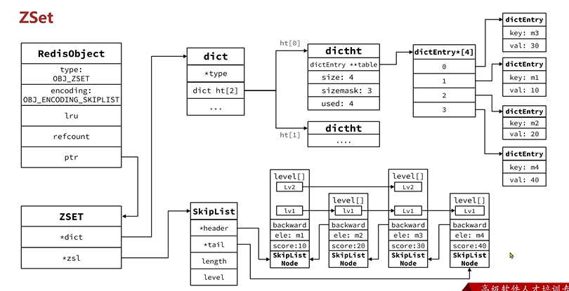
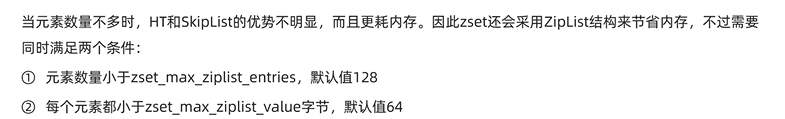

ZSet
---

键值存储（member和score，注意member是key,score是value）， 可排序

member必须唯一

可以根据member查询score

可实现编码方法

    skiplist 可以排序 键值存储

    hashtable(dict) 可以根据key找value（根据member找score）

在ZSet中使用了 skipList和hashTable(dict)结合来实现

ZSet何时使用ZipList?
---

在元素不多时，hashtable和skiplist的查询优势并不明显，主要是非常耗内存。

所以在元素数量小于128(CONFIG GET zset-max-ziplist-entries)

且每个元素大小小于64字节(CONFIG GET zset-max-ziplist-value)，

会使用ziplist 压缩列表

