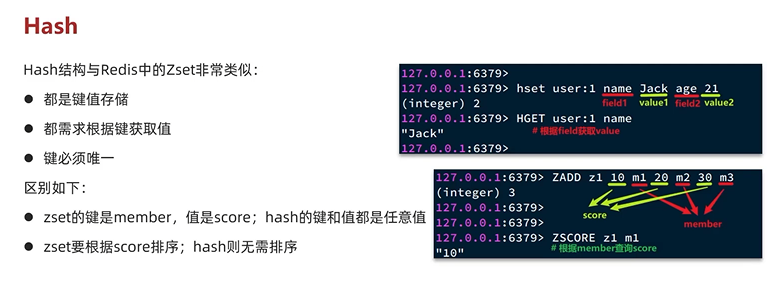
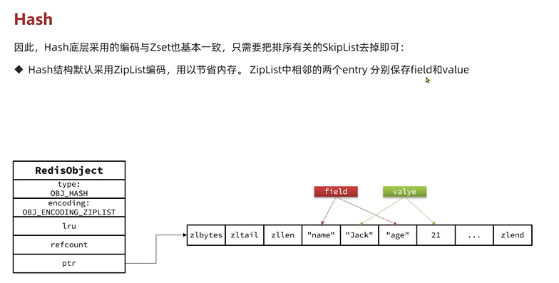
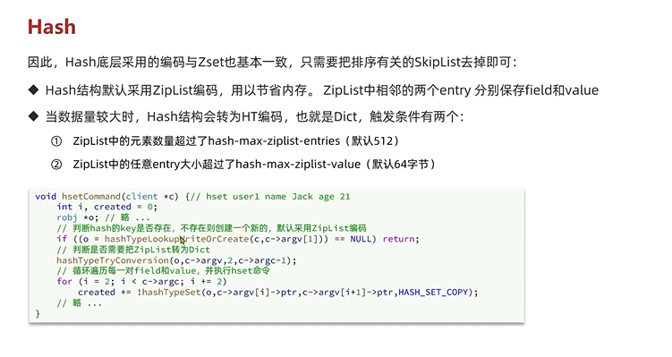
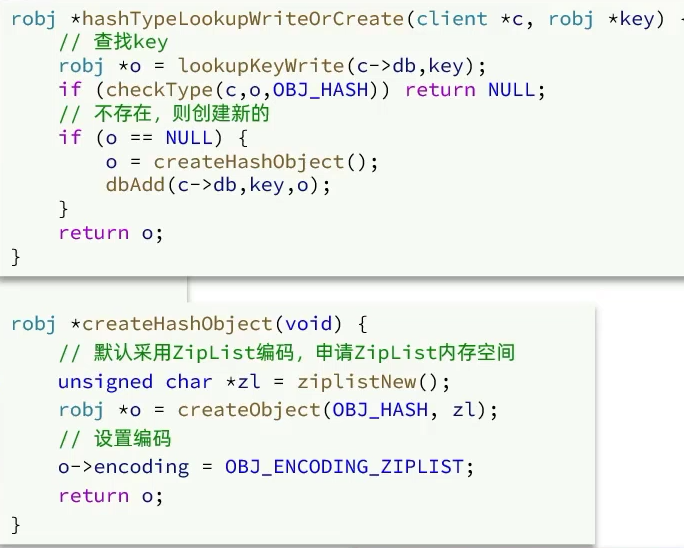
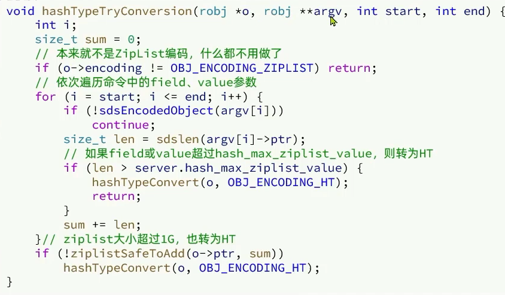
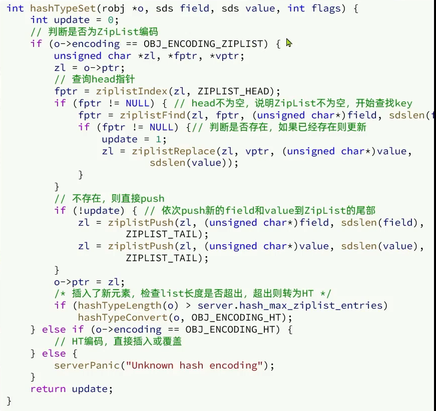

Hash
---

键值存储，唯一，和ZSet的区别是不用排序，hash的value可以是数字或者字符串

但是Zset是需要排序的 score必须是整数

hash的编码格式和zset十分相同 因为不需要排序 所以去掉了skiplist

默认采用的也是ziplist key和value紧挨存储

在元素数量小于512(CONFIG GET hash-max-ziplist-entries)

且每个元素大小小于64字节(CONFIG GET hash-max-ziplist-value)

使用的是ZipList 如果一个条件被打破，就会变成dict(hash table)

