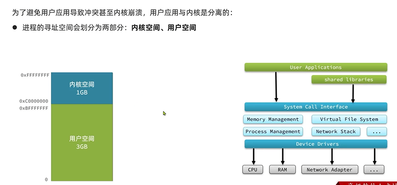
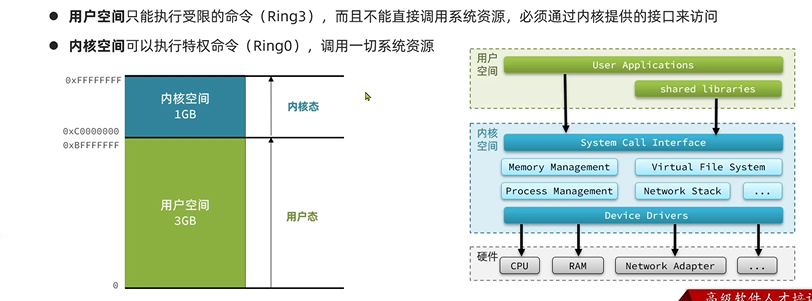
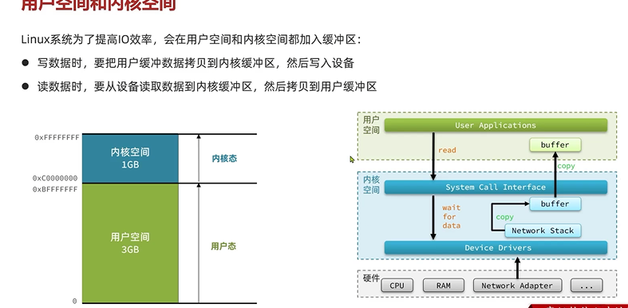
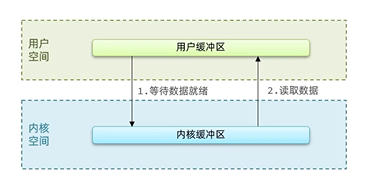
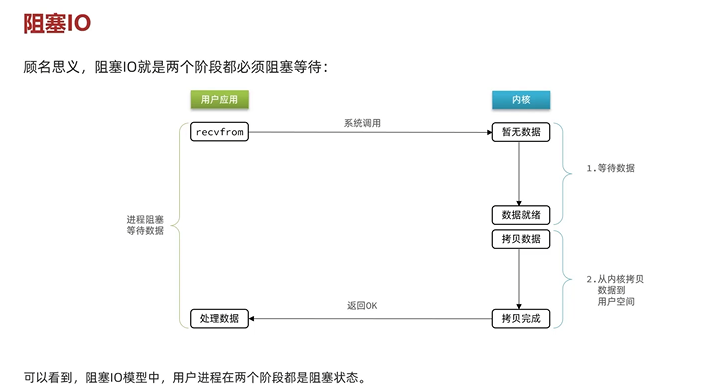
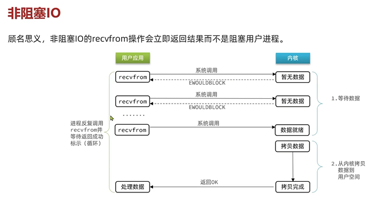

进程寻址空间 分为

    内核空间，用户空间

32位系统 地址最大 2^32  4GB

用户空间只能调用ring 3级别的命令

内核空间可以调用ring 1级别的命令

进程在内核和用户空间切换 分别称为 用户态 内核态

缓冲区buffer
---

用户空间和内核空间都有缓冲区buffer

比如Java的IO流 读写到缓冲区 先是在用户空间的缓冲区操作

内核空间的缓冲区主要起到一个缓存的作用

从内核读取数据 如果有的话 直接就会返回

如果用户想将数据写入磁盘，就需要切换到内核

但是内核空间是没有你的数据的 数据在用户空间

所以 需要先将用户空间的数据拷贝到内核空间

然后在把内核空间的数据写入到磁盘

如果是从硬盘读取数据 首先看内核空间有没有数据

如果没有要去磁盘寻址（这个过程中进程需要等待）

如果不是读的磁盘 是读网卡(如果网络数据没传过来，也需要等待)

等待完毕 从磁盘或者网卡读到内核空间的缓冲区

接下来把内核空间的数据拷贝到用户空间的缓冲区

影响IO效率最大原因是等待数据，用户空间内核空间数据的拷贝

阻塞IO
---

读取数据为例

当用户读取硬件设备数据（磁盘或者网卡）

要等待数据就绪，当寻址完毕并读取到内核缓冲区 才能开始读取数据

将内核缓冲区拷贝到用户缓冲区

阻塞IO指两个地方阻塞

    1 在用户线程调用内核函数（如recvfrom函数(经socket接收数据)）的方法时 等待数据返回要阻塞

    而内核此时等待数据（磁盘或者网卡把数据读取到内核缓冲区） 读完了 内核等待结束

    2 内核空间把数据拷贝到用户空间的缓冲区

    3 用户线程在数据返回到用户空间的缓冲区后，就可以处理数据了

在内核等待和数据拷贝阶段 用户线程都处于等待阻塞阶段

非阻塞IO
---

非阻塞IO，即在用户线程调用内核函数（如recvfrom函数(经socket接收数据)）的方法时 

立即返回结果，而不是一直等待 如果没有数据 放到一个事件队列，轮询调用

而这种轮询会占用CPU执行命令

直到数据就绪到达内核缓冲区 然后把数据从内核缓冲区拷贝到用户缓冲区

非阻塞IO和阻塞IO的区别是

    等待数据就绪时，前者是等待阻塞，后者是轮询

    但是在二阶段数据拷贝的时候依然是阻塞状态