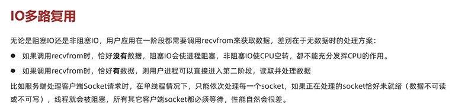
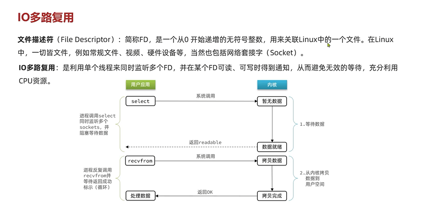

IO多路复用
---

文件描述符
---

file descriptor 简称FD

文件描述符在形式上是一个非负整数。

实际上，它是一个索引值，指向内核为每一个进程所维护的该进程打开的文件的记录表。

当程序打开一个文件时，内核向进程返回一个文件描述符。

服务器端采用单线程通过select/epoll等系统调用获取fd列表，

遍历有事件的fd进行accept/recv/send，使其能支持更多的并发连接请求

socket读取数据本身可以看作操作文件，进行读写。

Linux 每一个文件都会有个对应的FD（文件描述符号）

    在IO多路复用中，用户现金调用的不是recvfrom函数 而是select函数

select函数内部有bitmap结构，一位对应一个fd，最大1024个

select内部可以监听多个FD（轮询），如果一个或者多个FD就绪（数据已经在内核空间了），就返回结果readable

然后再调用recvfrom函数 从内核空间拷贝数据到用户空间

    recvfrom只能监听一个FD，select能监听多个FD。

select缺点：
---

单个进程所打开的FD是有限制的，通过FD_SETSIZE设置，默认1024

每次调用select，都需要把fd集合从用户态拷贝到内核态，这个开销在fd很多时会很大

对socket扫描时是线性扫描，采用轮询的方法，效率较低（高并发时）

select实现方式
---

select 

poll(投票; 民意调查; 民意测验; 选举投票; 计票; 投票数)

epoll
