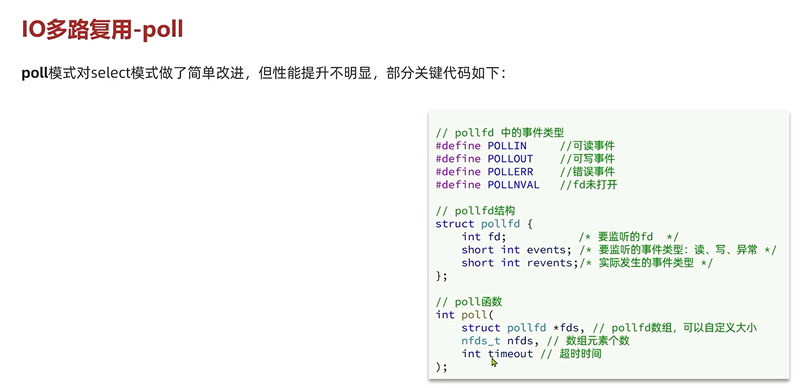
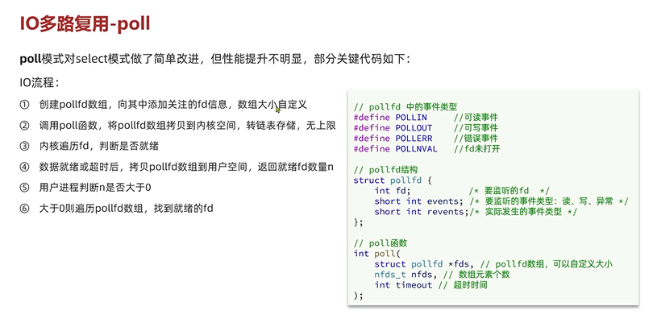
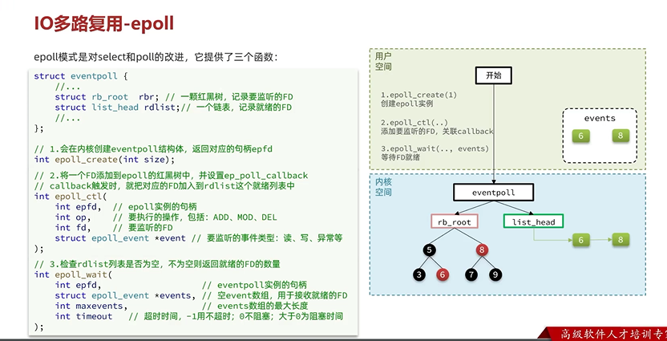
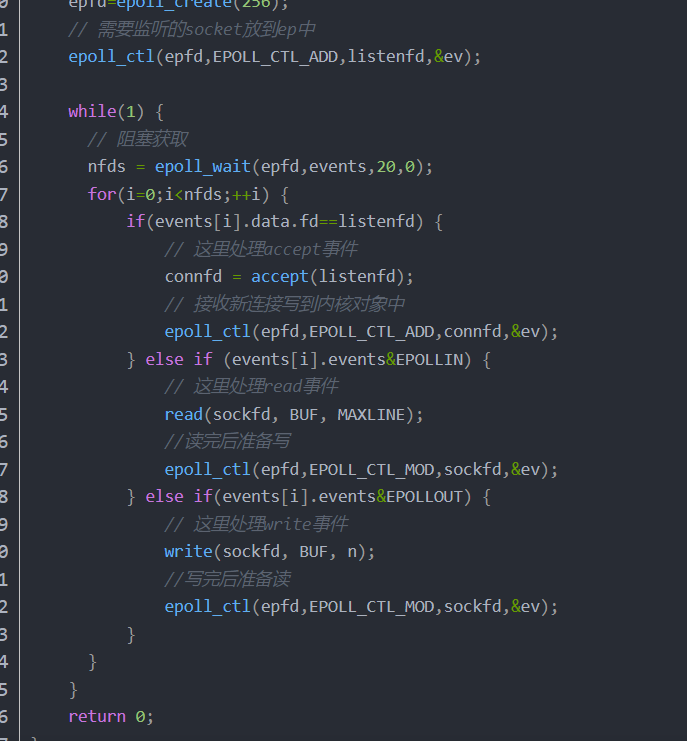
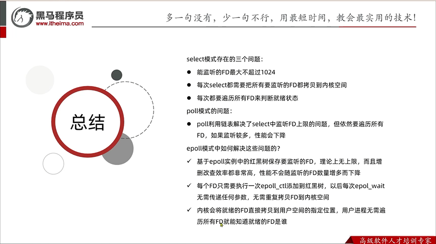

poll模式
---

创建pollfd数组 向其中添加关注的fd信息，数组大小自定义

调用poll函数 将pollfd数组拷贝到内核空间 转链表存储，无上限

内核遍历fd 判断是否就绪

数据就绪或者超时后， 拷贝pollfd数组到用户空间 返回就绪fd数量n

用户进程判断n是否大于0

大于0则遍历pollfd数组 找到就绪的fd 

poll模式与select模式相比 
---

相同的点

    也需要将fd从用户空间拷贝到内核空间 内核遍历后再拷贝回用户空间 内核回返回就绪的fd数量

    用户空间判断fd数量是否大于0 来遍历fd数组

提升的点（fd数组可自定义）

    select监听的fd是有上限的（1024） poll模式是可以自定义的

epoll模式 （event poll）
---

epoll模式中使用红黑树（poll使用的是链表）保存要监听的fd

    性能不像链表随着FD的数量变多而下降

另外使用了一个双向链表保存了就绪的fd，拷贝回用户空间是拷贝的双向链表（而不是select和poll把所有的fd数组都拷贝回去）

select和poll每次都会将整个fd数组拷贝到内核空间  而epoll首次调用epoll_ctl拷贝

fd就绪后，内核空间会调用回调函数就绪fd存入epoll_wait的双向链表，并唤醒epoll_wait,通知epoll有就绪fd

用户进程得到通知，遍历就绪的fd链表

epoll_wait是阻塞的吗？
---

默认是阻塞的 -1永不超时，0不阻塞，大于0为阻塞时间

select\poll\epoll之间的区别
---

|   | select | poll | epoll |
| :-----| :-----| ----: | :----: |
| 数据结构 | bitmap | 数组 | 红黑树 |
| 最大连接数 | 1024 | 无上限 | 无上限 |
| fd拷贝 | 每次调用selec拷贝 | 每次调用poll拷贝 | fd首次调用epoll_ctl拷贝，每次调用epoll_wait不拷贝 |
| 工作效率 | 轮询O：(n） | 轮询：O(n） | 回调：O(1） |

三者对比
---

