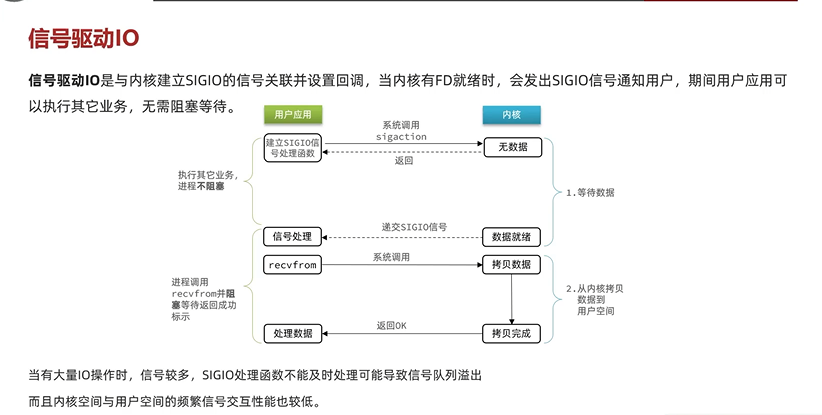
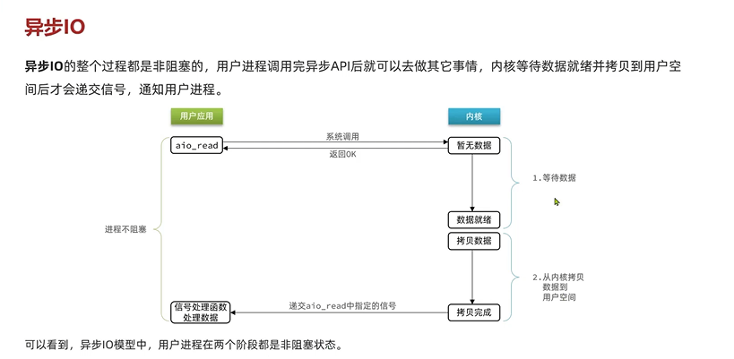

信号驱动IO
---

用户空间和内核空间建立信号关联并设置回调

当内核有FD就绪，回调用户空间发送信号通知用户

在这个期间 用户线程可以执行其他任务，无需阻塞

缺点

    信号队列数据较多时,用户空间没来得及及时处理，可能导致队列溢出。

    在用户空间和内核空间 频繁的信号交互 性能也不高。

异步IO
---

用户调用aio_read函数后，直接返回。进程是不阻塞的

当内核空间 数据就绪后，把内核中的数据拷贝到用户空间后

内核空间递交aio_read中知道的信息给用户空间，告诉用户完成了，用户得知完成了 自己开始处理数据。

缺点或者说隐患
---

    并发请求大量异步调用aio_read函数，导致内核空间内存压力剧增，需要在用户空间做限制。

IO同步还是异步的判断标准？
---

IO操作是同步还是异步，关键看数据在内核空间与用户空间的拷贝过程（数据的读写IO操作）

就是阶段二（阶段一数据就绪（磁盘或者网卡把数据读取到内核缓冲区），阶段二拷贝数据）

是同步还是异步！

 