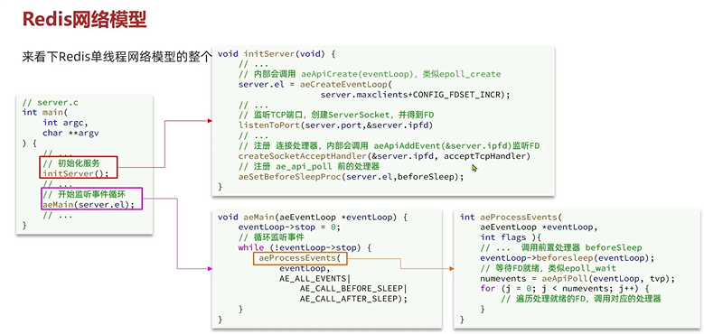
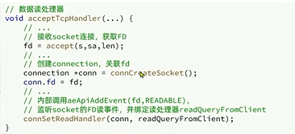

Redis到底是单线程还是多线程？
---

如果是redis的核心逻辑（redis的命令处理）是用单线程的

如果是整个redis 是多线程的 比如持久化：

（Redis执行BGSAVE指令，进行快照持久化时，就会fork出一个子进程，然后子进程去创建快照，完成持久化操作。）

何时引入的多线程？
---

在4.0中 引入多线程处理耗时较长的任务，例如异步删除命令unlink(异步删除，del是同步删除)

在6.0中 在核心网络模型中引入了多线程，进一步提高对于多核CPU的利用率

为什么要选择单线程？
---

最重要的纯内存操作，避免多线程上下文切换，和多线程并发安全问题

源码中的API
---

redis的main方法
---

初始化服务:

    会调用类似epoll_create的方法 
    
    创建server socket 监听TCP端口 得到FD
    
    监听FD 

开始监听事件循环：

    循环监听事件

    等待FD就绪，遍历处理就绪的FD   

监听客户端的FD
---

注册到红黑树 记录要监听的FD

