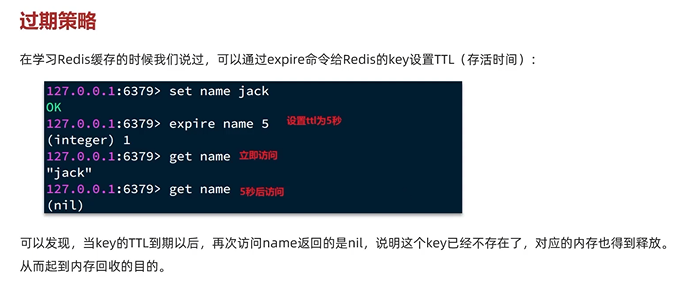
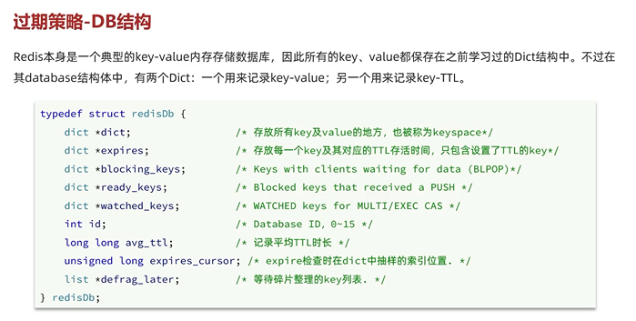
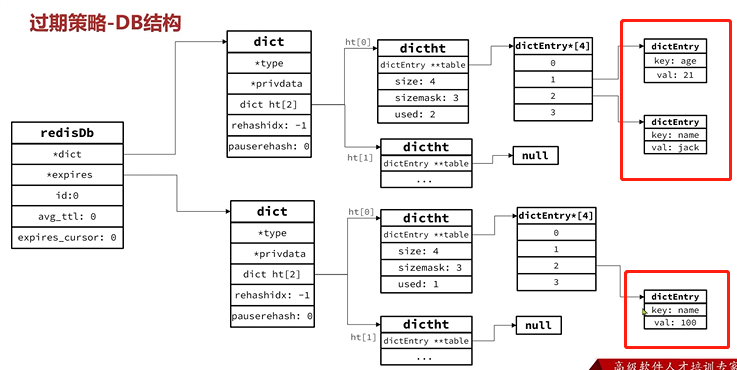
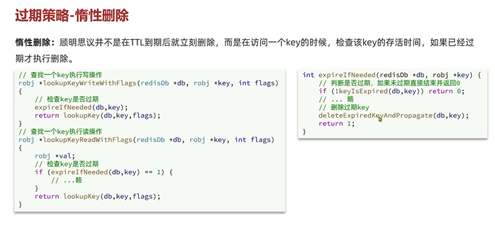
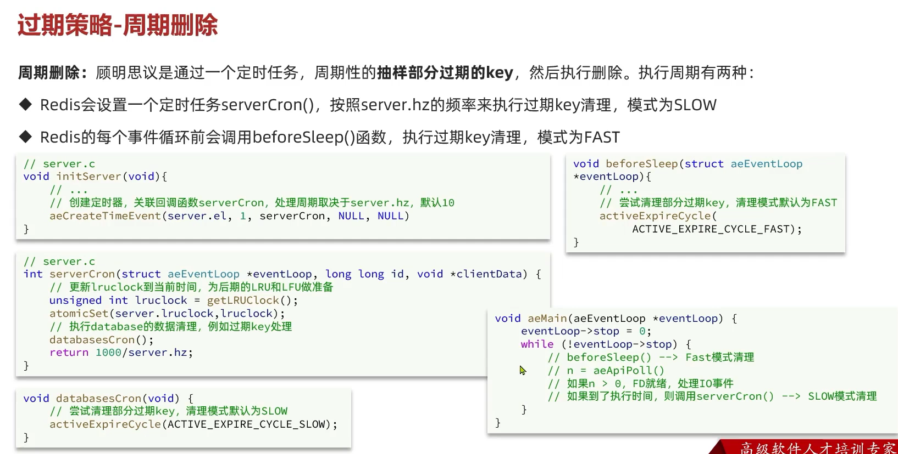

过期策略
---

key-value保存在dict结构中

在database中 有两个dictionary 

一个来记录key-value

另一个用来记录key-TTL

    dict *expires (e ke si pei er)

如下图所示 dict中key=name,val=100 的 记录的就是过期时间

惰性删除
---

不是TTL(Time To Live)到期后自动删除，而是访问一个key的时候检查key的存活时间

如果过期才删除

惰性删除的问题
---

如果很多key长时间不访问，就会对内存造成压力

过期策略-周期删除
---

周期性的抽样部分过期的key

创建server socket，创建event pool，讲server socket注册到event pool

执行aeMain方法，开始事件循环