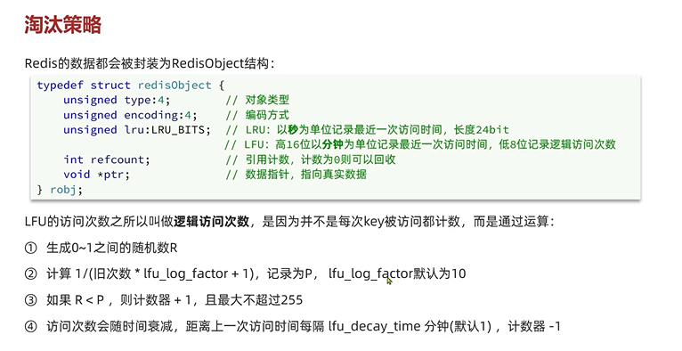

内存淘汰策略
---

当redis内存达到设定的阈值 redis主动挑选`部分key`

删除以释放更多的内存的流程

redis 处理`任何客户端命令`的方法process command 中尝试做内存淘汰

如果设置了 server.maxmemory 属性 并且没有正在运行的lua脚本

`maxmemory默认是注释的`

    检测到当前系统为32位，因为32最大内存为4G，在没有设置maxmemory的时候，

    这里默认将最大内存设置为3G，并且使用noeviction淘汰策略

    当系统不是32位时，maxmemory就是为0，redis不会对可用内存进行能判断，

    直到程序因无可用内存异常崩溃。

会尝试进行内存淘汰

如果进行内存淘汰失败了 会拒绝执行客户端命令

有哪些淘汰策略？
---
通过配置`maxmemory-policy`来设置

1   no-eviction: 不淘汰任何数据 内存不足拒绝写入新数据 默认就是这个策略

2   valatile-ttl: 比较设置的TTL的key,TTL越小的key越先被淘汰

3   allkeys-random: 对全体key，随机进行淘汰

4   valatile-random: 对设置了TTL的key，随机进行淘汰

5   allkeys-lru: 对全体key 基于lru算法进行淘汰

5   valatile-lru: 对设置了TTL的key 基于lru算法进行淘汰

5   allkeys-lfu: 对全体key 基于lfu算法进行淘汰

5   valatile-lfu: 对设置了TTL的key 基于lfu算法进行淘汰

LRU (least recently used) 最少最近使用
---
`least (li si te)最少`

`recently (rui sen te le)近来，最近`

用当前时间减去最后一次访问的时间，值越大则淘汰优先级越高

LRU (least frequently used) 最少频率使用
---

`frequently（fei kun te le)频繁 时常 经常`

统计每个key的访问频率 值越小淘汰优先级越高
 

RedisObject记录LRU和LFU信息
---

eviction-pool
---

eviction (e v ke sin) 逐出 收回

随机挑选一堆样本放入eviction pool

按升序排列放入pool 最越大的越容易淘汰

按什么升序放入eviction？
---

lru: 用当前时间减去最后一次访问时间

lfu: 用户255-lfu(频率)

tll: 用long的最大值减去ttl

倒序从eviction pool中取出key删除

