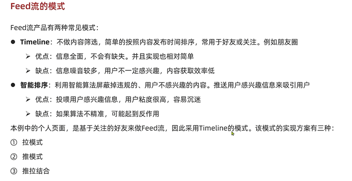
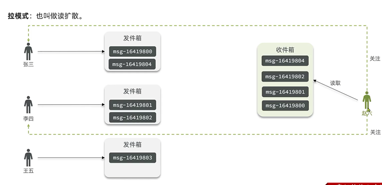
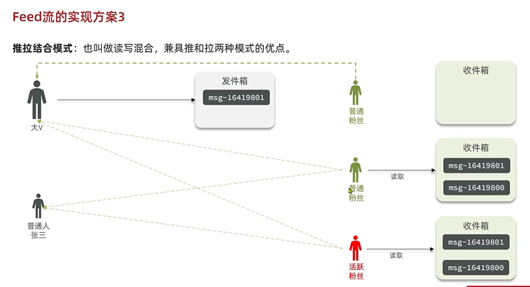
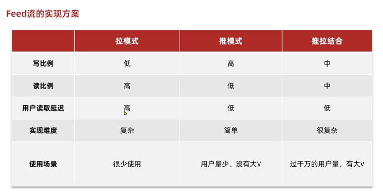
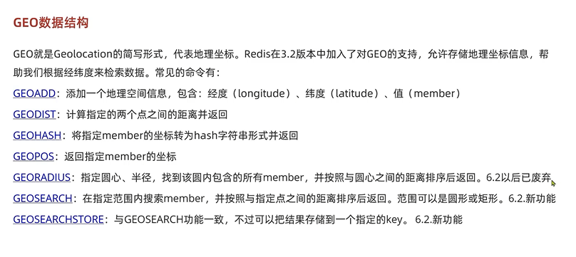
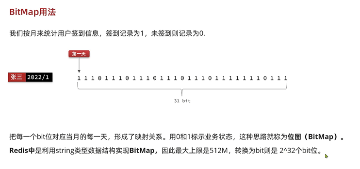
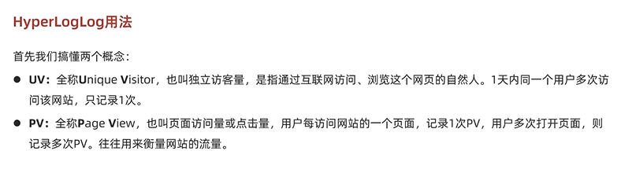

关注
---

set集合保存关注的用户的userid

共同关注
---

set.intersect(key1,key2)

对商品点赞
---

set集合 key是商品 如果用户点赞 set.add()

如果取消点赞 set.remove()

点赞排行榜
---

sortset(zset)

跑马灯(轮播广告)
---

list push pop

feed流 关注推送
---

拉模式

推模式

推拉模式

附件商户 店铺

使用GEO（geo-location 地理定位）

用户签到

使用bitmap（使用string类型，string类型上限512mb，二进制是2^32）

bitmap使用bit记录数据的状态 适合数据量较大 但是数据状态比较少的情况（1或者0）

也可以一个数据用两个bit位来存储状态（00, 10,11）

hyperLog

唯一性统计 可以统计独立访问量，同一时间内用户多次访问页面记录一次

redis的hyperLog基于string结构，每个hyperLog内存不超过16KB

