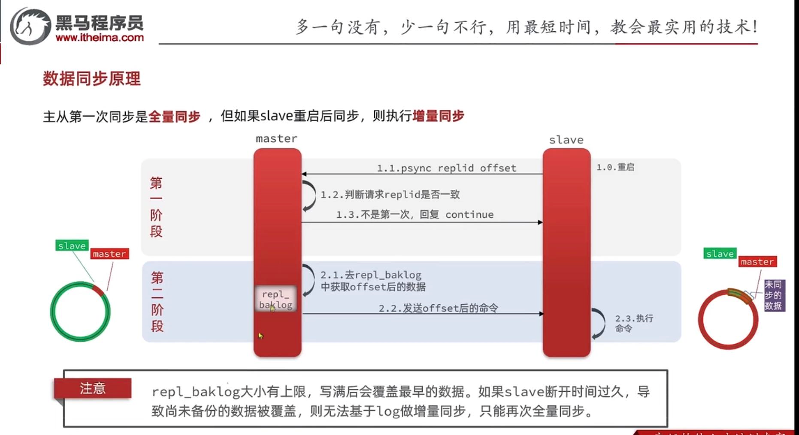
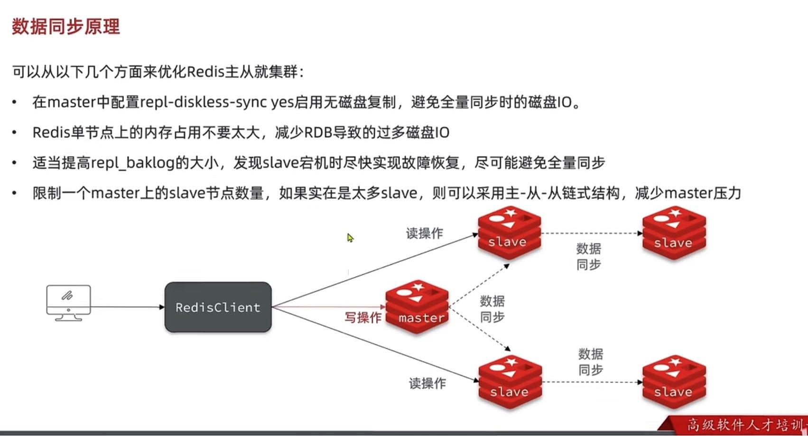
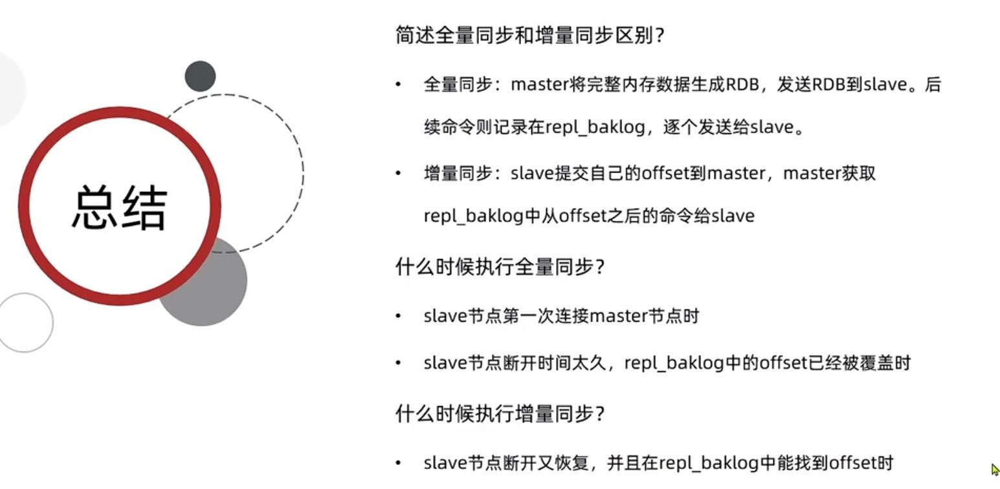

第一阶段
---

replica发送 psync replica offset 给master

master判断请求的repl_id是否一致

不是第一次 回复 continue

第二阶段
---

master去repl_baklog中获取offset后的数据

master 发送 offset 后的命令 replica收到手执行命令

优化主从集群同步
---

redis单节点内存不要占用过大，减少RDB导致过多磁盘IO

适当提高 repl_baklog文件大小，避免replica宕机，rel_baklog文件被覆盖

采用主从从的链式结构，减少master压力

全量同步 增量同步总结
---

哨兵模式 sentinel
---

监控 
    
    sentinel 不断监控 master和replica

自动故障恢复

    如果master故障，sentinel将replica 升级为新的master 

    当旧的master恢复后，也是以新的master为主

通知

    sentinel充当redis客户端的服务发现源

    当集群故障转移，将最新信息推送给redis client

