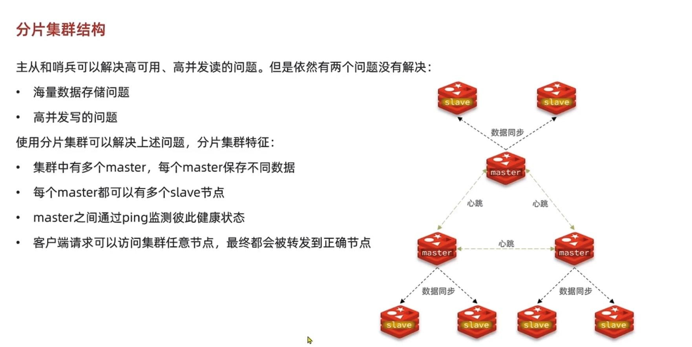
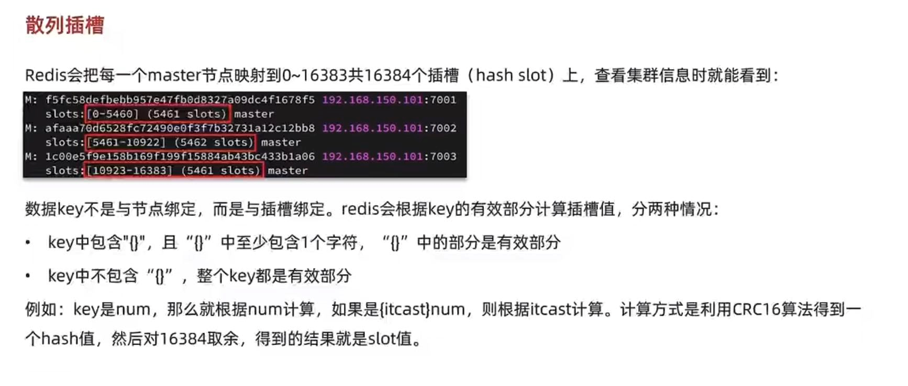
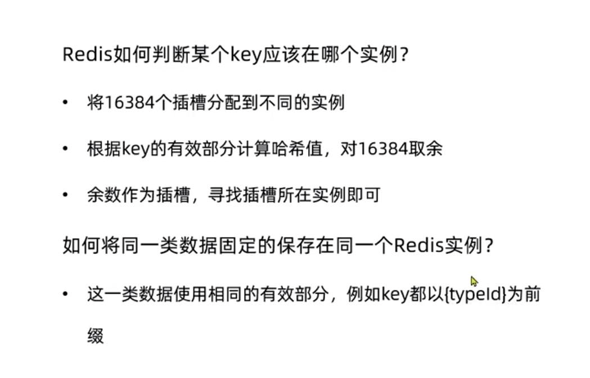

主从和哨兵可以解决高可用和 高并发读的问题

但是对于海量的数据存储问题，和高并发写的问题是没法解决的

分片集群的特征
---

集群中有多个master，每个master保存不同的数据

每个master都可以有多个replica节点

master之间通过ping监控彼此监控

redis client 可以访问集群任意节点 最终都会被转发到正确节点

散列插槽
---

redis中数据的key不是和节点绑定，而是和插槽绑定

redis根据key的有效部分计算插槽值

    key包含{}且{}中至少一个字符 那{}中的部分就是有效部分
    
    key不包含{},整个key都是有效部分

对于客户端请求的key，根据公式HASH_SLOT=CRC16(key) mod(取模/取余) 16384，

计算出映射到哪个分片上，然后Redis会去相应的节点进行操作

为什么插槽数是16384？
---

回答

(1)如果槽位为65536，发送心跳信息的消息头达8k，发送的心跳包过于庞大。

如上所述，在消息头中，最占空间的是myslots[CLUSTER_SLOTS/8]。当槽位为65536时，这块的大小是:65536÷8÷1024=8kb

因为每秒钟，redis节点需要发送一定数量的ping消息作为心跳包，如果槽位为65536，这个ping消息的消息头太大了，浪费带宽。

(2)redis的集群主节点数量基本不可能超过1000个。如上所述，集群节点越多，心跳包的消息体内携带的数据越多。

如果节点过1000个，也会导致网络拥堵。因此redis作者，不建议redis cluster节点数量超过1000个。

那么，对于节点数在1000以内的redis cluster集群，16384个槽位够用了。没有必要拓展到65536个。

(3)槽位越小，节点少的情况下，压缩比高Redis主节点的配置信息中，它所负责的哈希槽是通过一张bitmap的形式来保存的，

在传输过程中，会对bitmap进行压缩，但是如果bitmap的填充率slots / N很高的话(N表示节点数)，

bitmap的压缩率就很低。如果节点数很少，而哈希槽数量很多的话，bitmap的压缩率就很低。

如何将同一类数据固定保存在同一个redis实例里？
---

散列插槽是根据key的有效部分来计算hash值，然后对16384取余

所以可以把同一类数据的key都以`{typeId}`为前缀

保证相同类型的数据的key的`有效部分`是一样的

散列插槽
---

