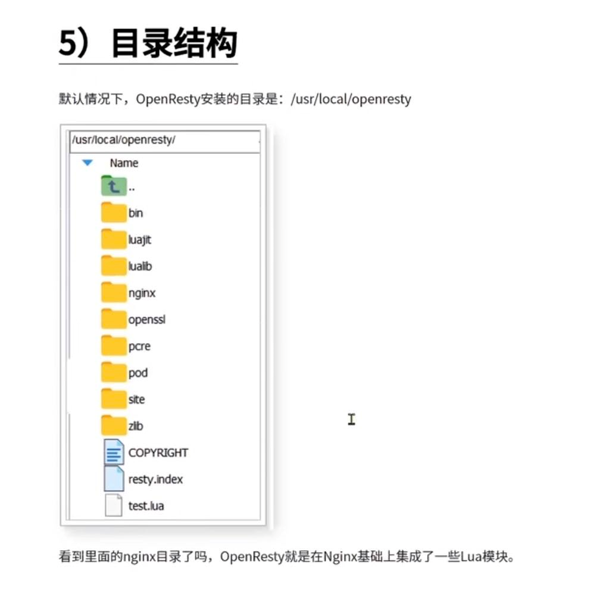
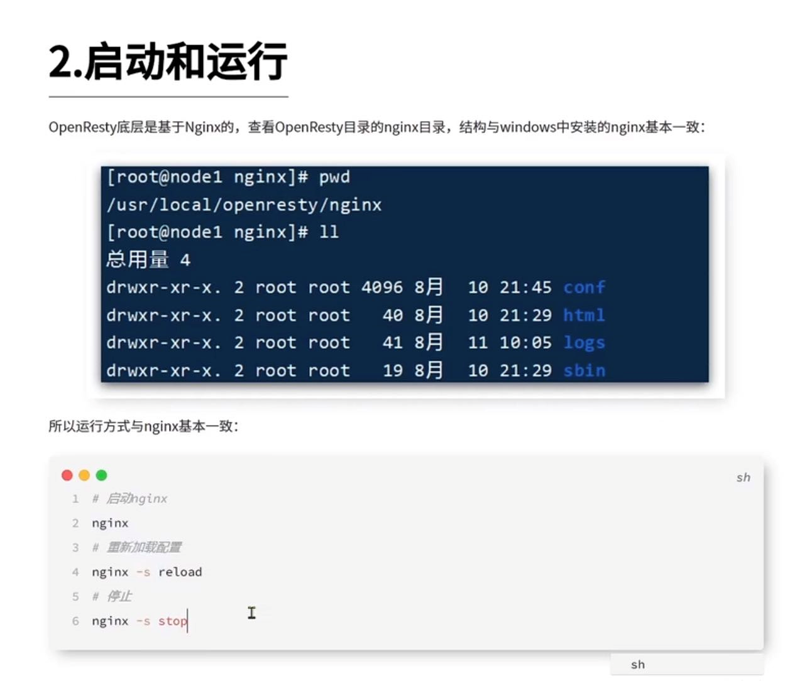
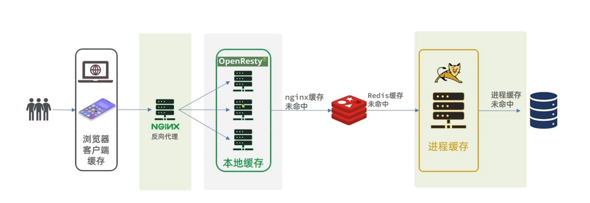
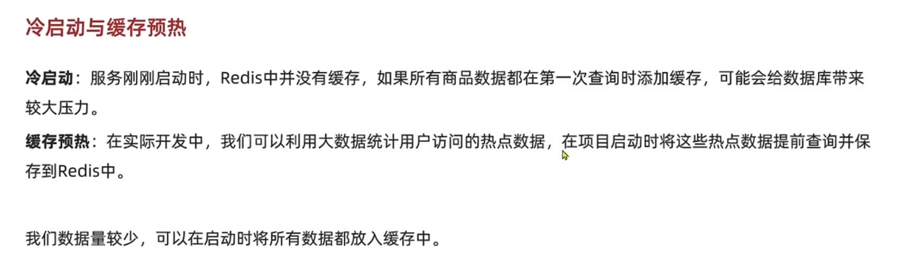
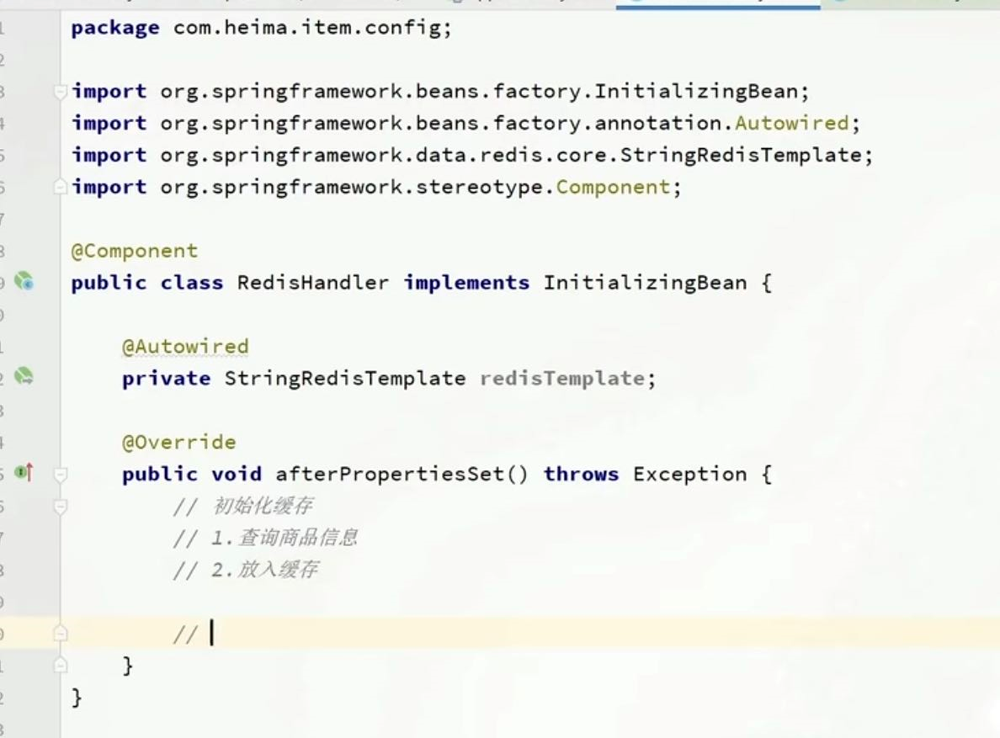

多级缓存方案
---

1   浏览器 和 客户端 缓存静态资源 减少数据从传输 提高响应速度

    或者使用Content Delivery Network，内容分发网络

    将媒体资源，动静态图片，HTML，CSS，JS等等内容缓存到距离你更近的IDC(互联网数据中心，简称IDC机房)，

    从而让用户进行共享资源，实现缩减站点间的响应时间等等需求

2   Nginx本地缓存(使用open resty 直接请求redis)

    nginx 服务器在接收到被代理服务器的响应数据之后，一方面将数据传递给客户端，

    另一方面根据proxy cache的配置将这些数据缓存到本地硬盘上。 

    当客户端再次访问相同的数据时，nginx服务器直接从硬盘检索到相应的数据返回给用户，

    从而减少与被代理服务器交互的时间。

3   redis缓存

    并非需要从tomcat中访问redis缓存，从nginx中可以使用lua脚本直接访问redis缓存

4   容器内部缓存（本地缓存）

    将缓存存放在例如tomcat进程内部 ,比如使用caffeine

5   进程未命中，查询数据库

OpenResty
---

resty 重塑；重新设计 rui s t 

open resty 集成了 nginx 和 lua脚本

基于 NGINX 的可伸缩的 Web 平台

OpenResty 的目标是让你的 Web 服务直接跑在 Nginx 服务内部,

充分利用 Nginx 的非阻塞 I/O 模型,不仅仅对 HTTP 客户端请求,

甚至于对远程后端诸如 MySQL,PostgreSQL,~Memcaches 以及 ~Redis 等都进行一致的高性能响应。

所以对于一些高性能的服务来说，

可以直接使用 OpenResty 访问 Mysql或Redis等

而不需要通过第三方语言（PHP、Python、Ruby）等来访问数据库再返回，这大大提高了应用的性能。

启动和运行

冷启动和缓存预热
---

使用InitializingBean初始化缓存
---

InitializingBean（yin yi xiu la z） 接口 afterPropertiesSet方法

@PostConstruct后面已经被废弃

  