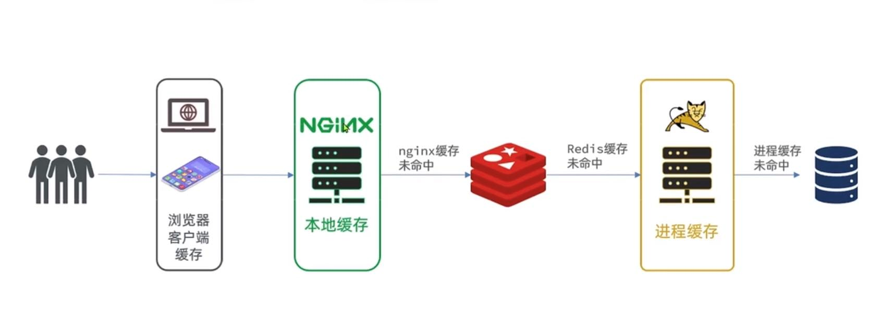
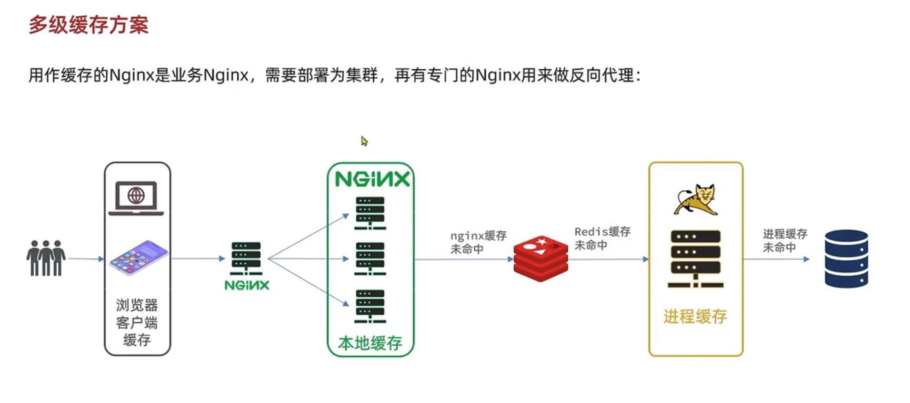

多级缓存方案
---

1   浏览器 和 客户端 缓存静态资源 减少数据从传输 提高响应速度

    或者使用Content Delivery Network，内容分发网络

2   Nginx本地缓存

    nginx 服务器在接收到被代理服务器的响应数据之后，一方面将数据传递给客户端，

    另一方面根据proxy cache的配置将这些数据缓存到本地硬盘上。 

    当客户端再次访问相同的数据时，nginx服务器直接从硬盘检索到相应的数据返回给用户，

    从而减少与被代理服务器交互的时间。

3   redis缓存

    并非需要从tomcat中访问redis缓存，从nginx中可以使用lua脚本直接访问redis缓存

4   容器内部缓存（本地缓存）

    将缓存存放在例如tomcat进程内部

5   进程未命中，查询数据库

  