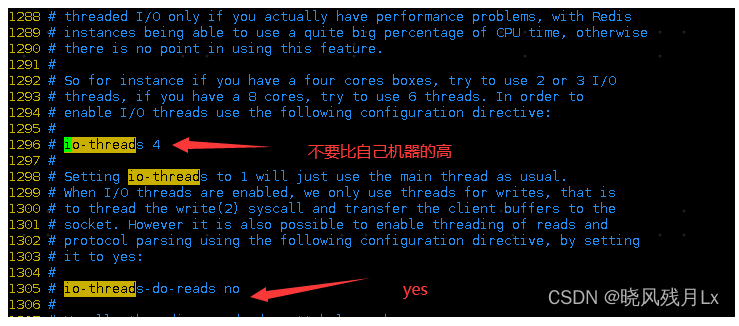

Redis7开启多线程
---

在单机模式下，可以开启多线程，但是在其他模式，最好不开启

Redis实例的 CPU开销不大但吞吐量却没有提升，可以考虑使用Redis7的多线程机制，

加速网络处理，进而提升实例的吞吐量

注意线程数
官方的建议是如果为 4 核的 CPU，建议线程数设置为 2 或 3，如果为 8 核 CPU 建议线程数设置为 6，

线程数一定要小于机器核数，线程数并不是越大越好。

设置io-thread-do-reads配置项为yes，表示启动多线程