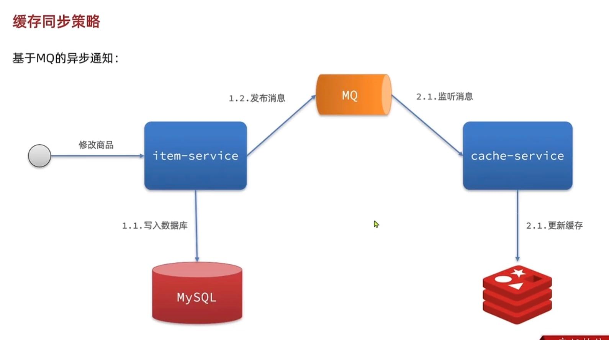
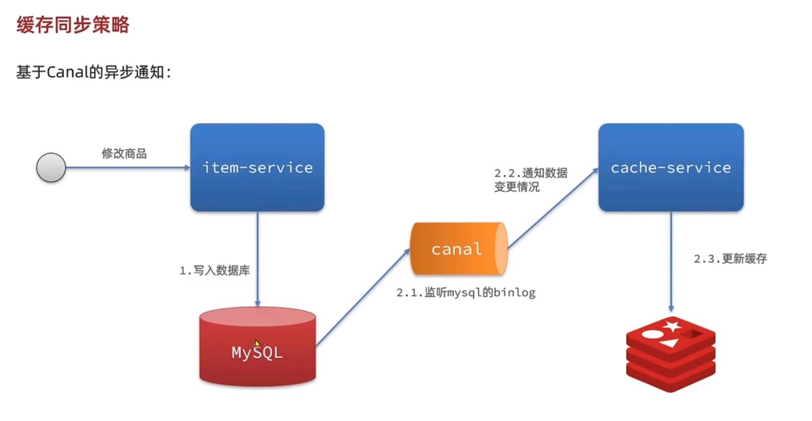
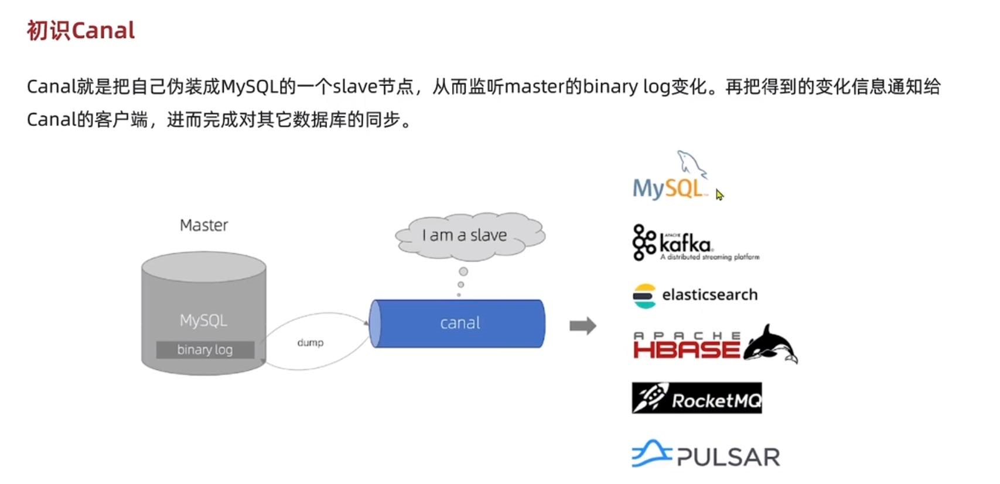
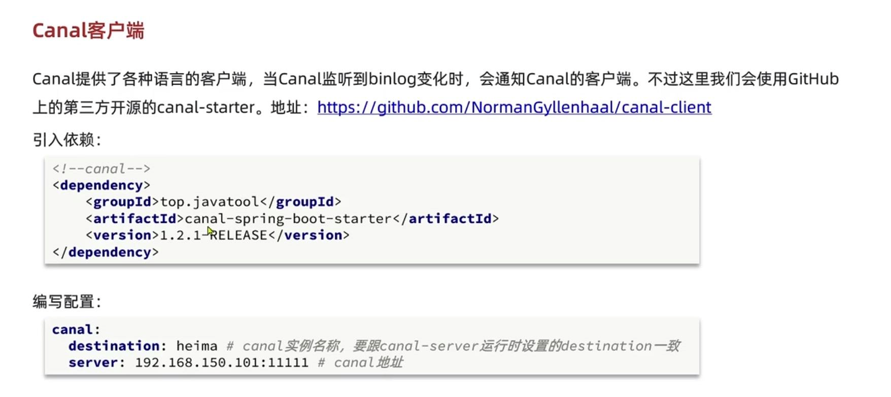
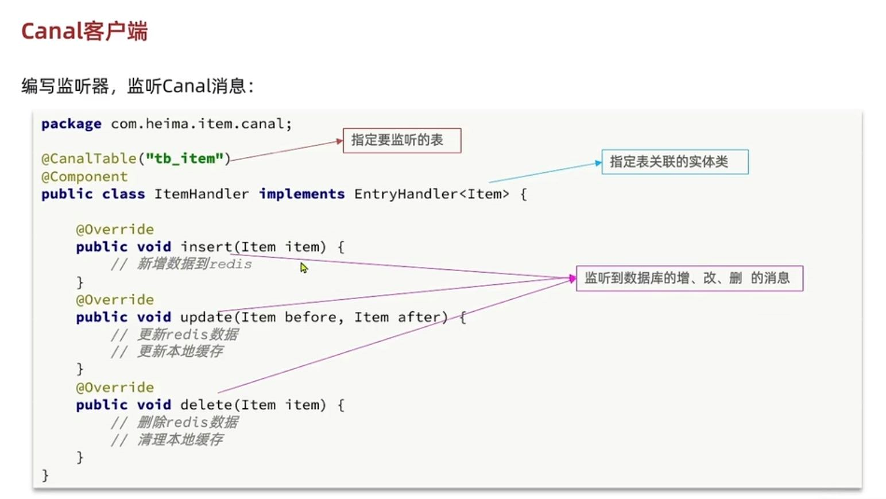
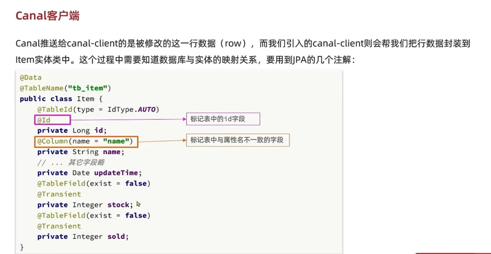
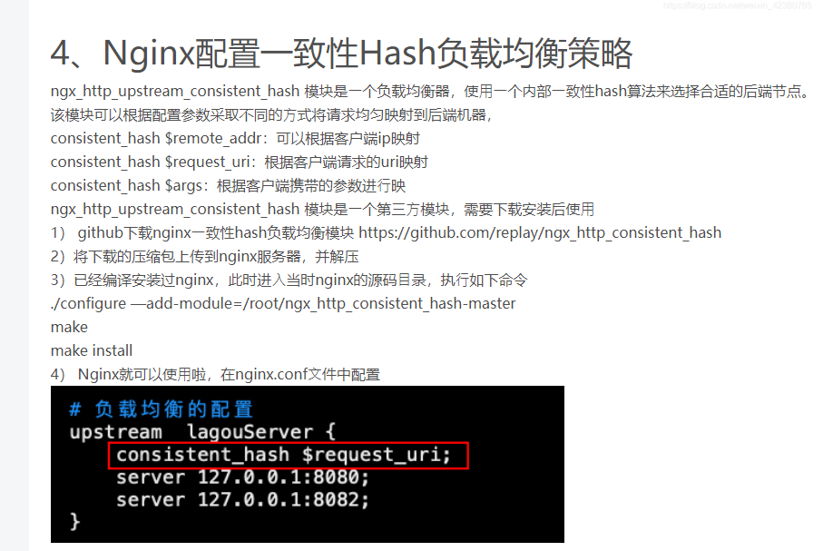

缓存同步策略
---

缓存同步常见三种方案

    设置有效期
    
    同步双写（代码入侵，耦合度高）

    异步通知（时效性低，使用消息中间件）

基于MQ的异步通知
---
1   修改商品信息 写入数据库 并发送消息（这里会有代码入侵）

2   监听消息 更新缓存

基于Canal的异步通知
---

canal 渠道，运河 ke na e

1   修改商品信息 写入数据库 Canal 监听MySQL的bin.log日志

2   Canal做通知 更新缓存

相当canal把自己伪装成slave节点，监听master的binary.log的变化

把得到的变化信息通知给canal客户端（java代码），再发送消息给比如MySQL，Kafka，ElasticSearch等

canal客户端
---

多级缓存总结
---

1   浏览器,客户端缓存静态资源 CDN内容分发网络

2   Nginx做反向代理 负载均衡

3   OpenResty本地缓存 静态资源 使用lua脚本查询redis缓存，redis缓存未命中则查询tomcat

4   tomcat使用本地缓存，弱本地缓存未查询到，则查询数据库

    查询本地缓存时，需要本地缓存的负载均衡算法做调整

    查询时，对业务ID进行hash取模，保证能命中数据。

nginx配置一致性hash负载均衡算法
---

consistent_hash $request_uri：根据客户端请求的uri映射

参考
---

https://www.csdn.net/tags/MtTaMgwsOTAwMzM5LWJsb2cO0O0O.html

