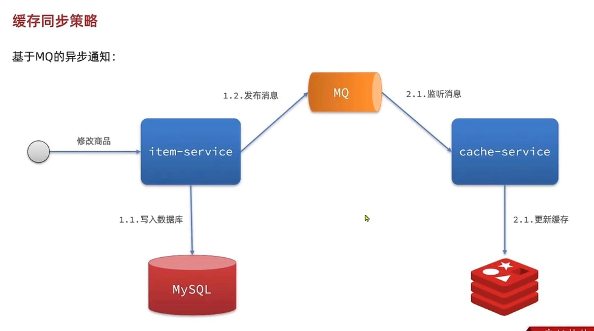

缓存同步策略
---

缓存同步常见三种方案

    设置有效期
    
    同步双写（代码入侵，耦合度高）

    异步通知（时效性低，使用消息中间件）

基于MQ的异步通知
---
1   修改商品信息 写入数据库 并发送消息（这里会有代码入侵）

2   监听消息 更新缓存

基于Canal的异步通知
---

1   修改商品信息 写入数据库 Canal 监听MySQL的bin.log日志

2   Canal做通知 更新缓存

