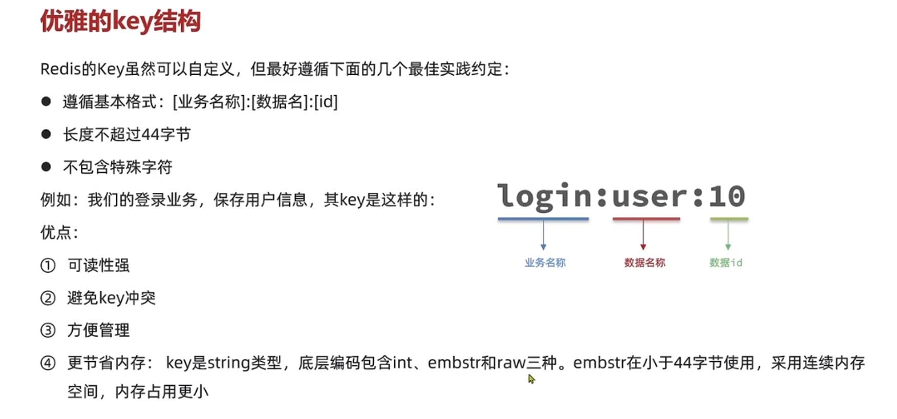
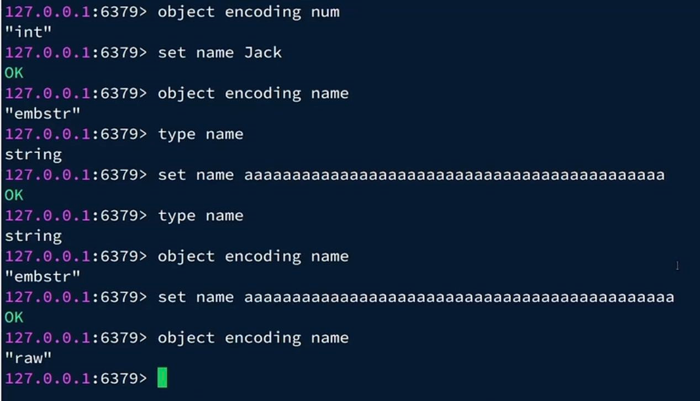
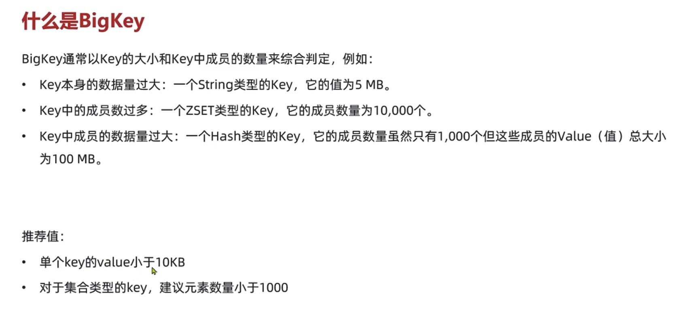
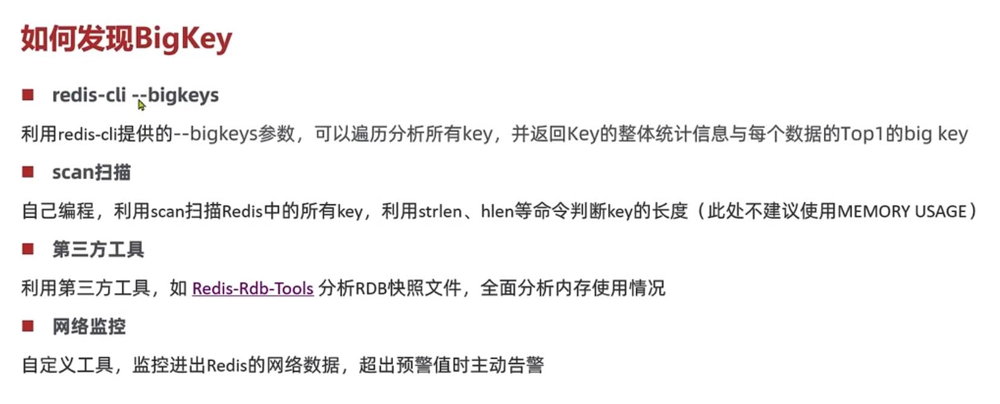

key设计
---

key遵行基本格式 [业务名]:[数据名]:[id]

    如 login:user:10

长度不超过44字节(key是String类型，在String中，emstr在小于44字节使用，采用连续内存空间，内存占用小)

不包含特殊字符

BigKey
---

单个key最好别超过10KB，

对于集合类型的key,建议元素数量不超过1000个

key过大会造成，在读请求时 少量的QPS就会导致带宽使用率被占满

对元素较多的hash list zset做运算耗时长，阻塞主线程

bigkey的数据序列化和反序列化会导致CPU使用率暴增

如何找到bigkey？
---

    redis-cli --bigkeys 信息不完整

    redis-rdb-tools离线分析工具分析rdb快照

异步删除key
---

    UNLINK key
