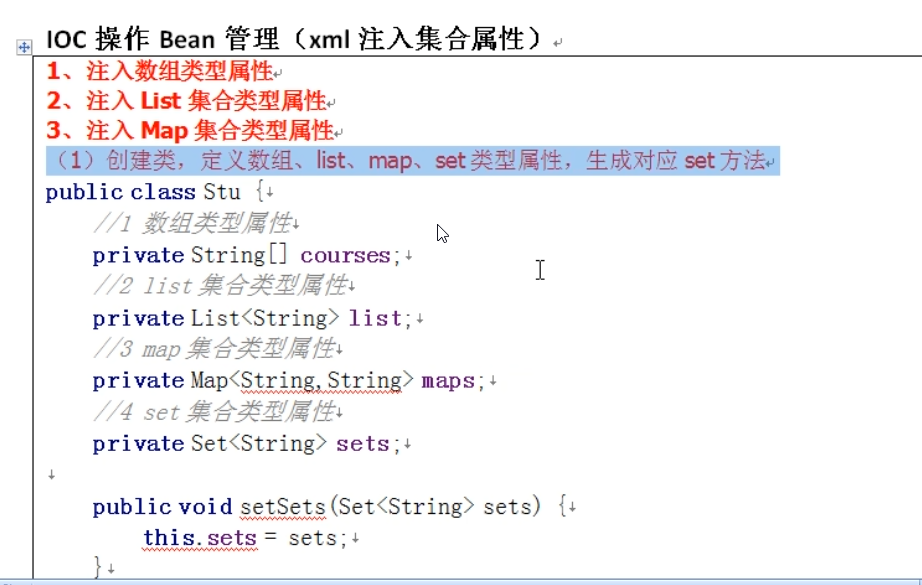

什么是bean管理
---
bean管理分为两步

1 spring 创建对象

2 spring 注入属性

bean factory和 application context
---

bean factory负责创建bean 

application context是bean factory的子接口

application context基于bean factory 创建好的对象上完成其他功能 比如AOP, DI

bean管理的实现方式有两种  一 基于xml配置文件方式管理bean 二 基于注解方式
---
一 基于xml配置文件方式管理bean

1.基于xml方式创建对象

在bean标签中的属性

*   id属性 唯一标识，别名
    
*   class属性 创建类的全路径

*   name属性 类似于id，但是可以加特殊符号类似/

xml创建对象默认基于执行无参构造方法创建对象

2. 基于xml方式注入属性 **DI：依赖注入，注入属性。在基于创建对象的基础上完成**
    
  依赖注入可用通过（1）set方法注入和（2）有参构造方式注入

注入外部bean
---

注入内部bean
---

级联属性
---
1

2

集合属性
---

对象集合属性
---

把集合注入部分提取出来 引入空间名称util
---

