AspectJ
---

Aspect并不是Spring aop的组成部分，是独立的AOP框架 spring将aspect集成了进来

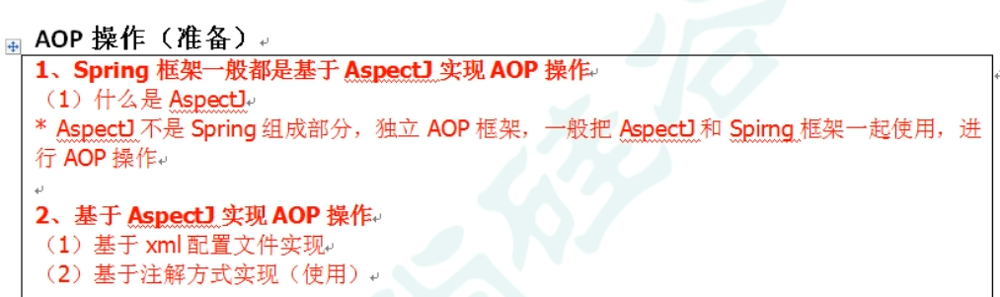

AspectJ切入 引入包

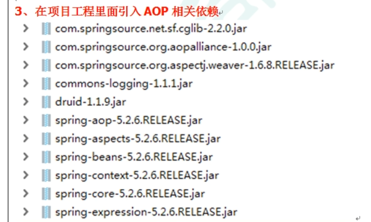

表达式

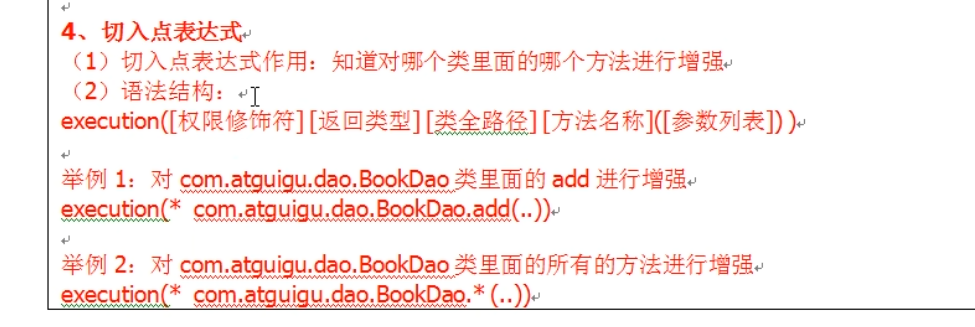

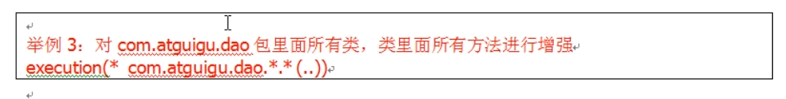

实现步骤
---

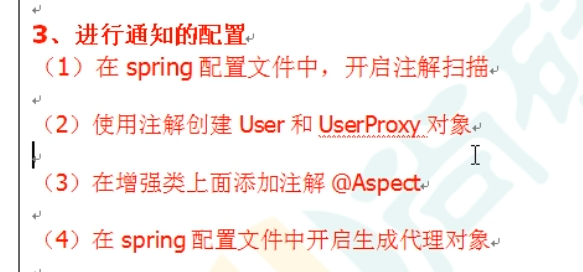

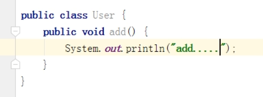

@Aspect和@Component

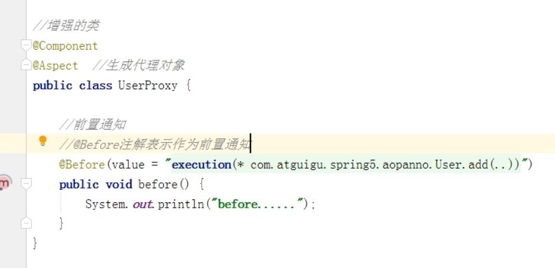

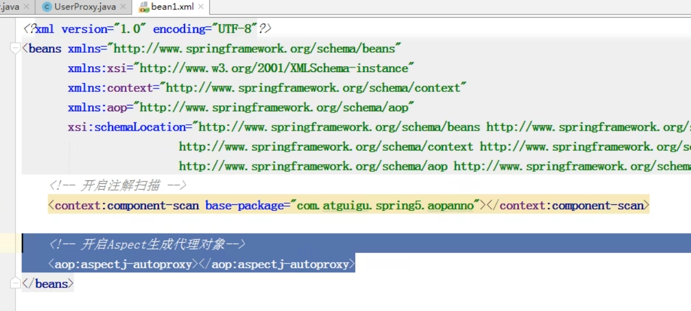

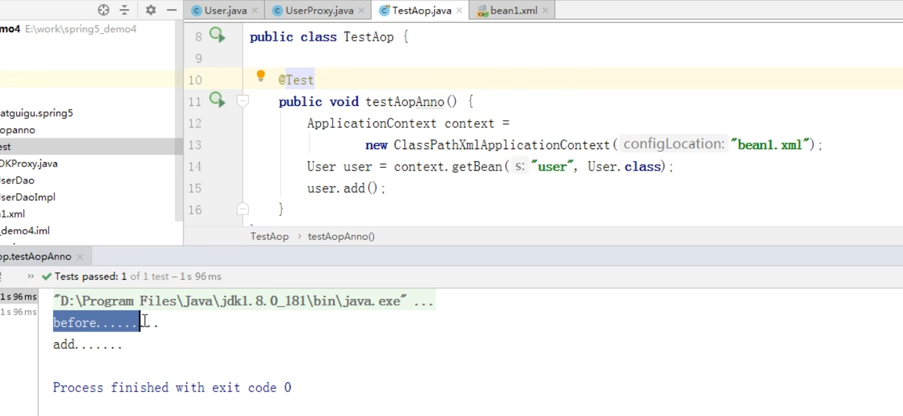

相同切入点表达式
---
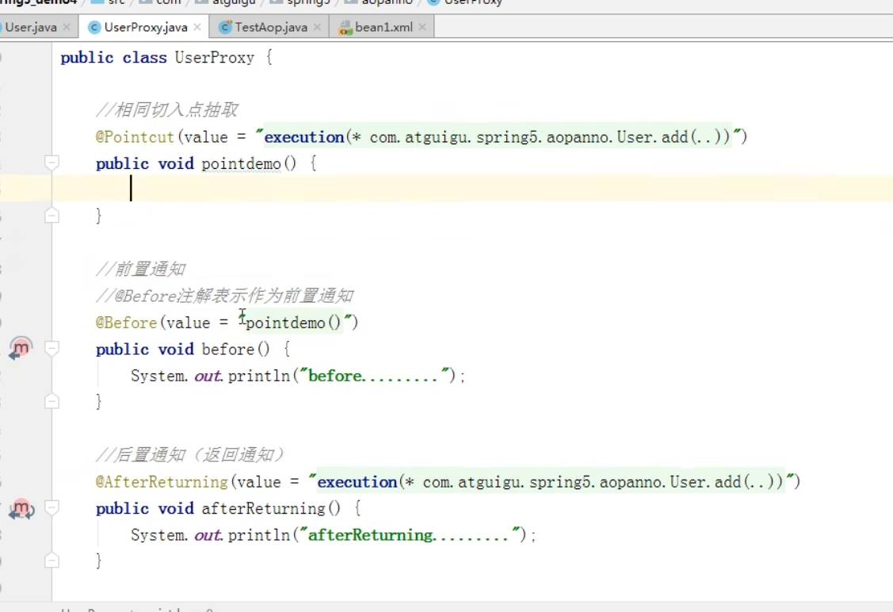

@Order设置优先级
---

@Order 越小 优先级越高

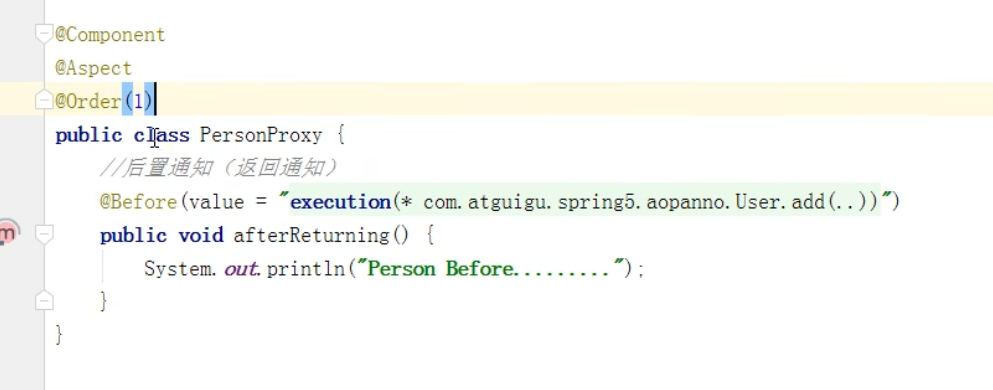

xml配置aspectJ
---
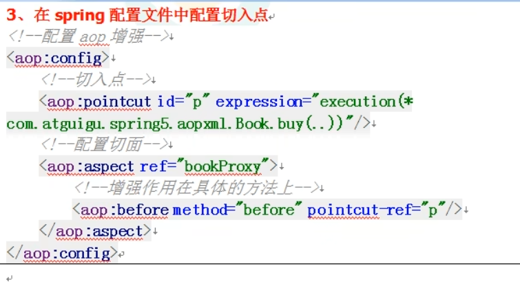

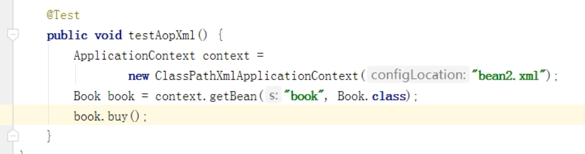

完全注解方式配置aspectJ
---

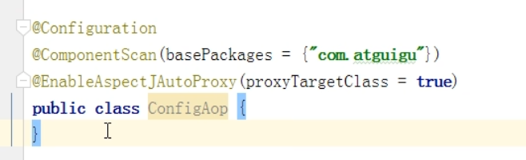

spring aop 和AspectJ的对比
----

动态代理 aspectj是在编译时增强 生成的字节码层面修改

静态织入 而spring aop是在运行时增强 运行时有额外开销

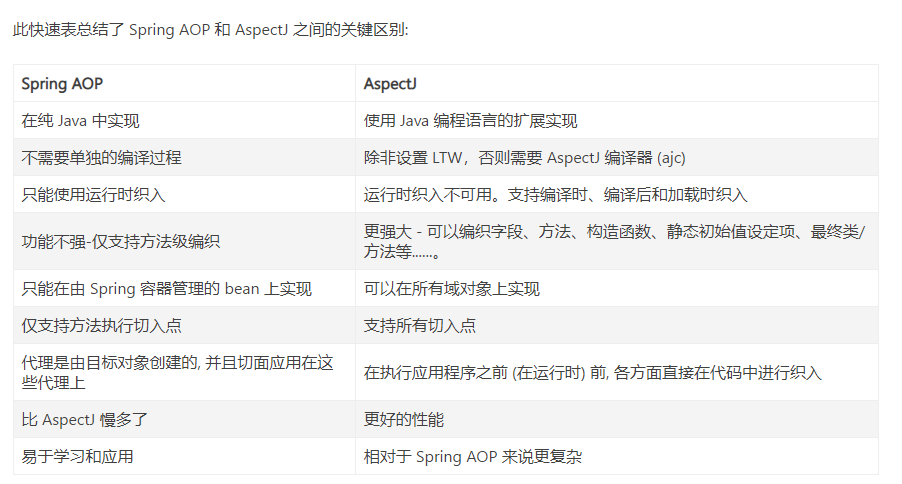

多个切面
---

环绕通知在methodPoint.proceed(); 嵌套执行

