事务特性
---

ACID

原子性

一致性

隔离性

持久性

声明式事务和编程式事务
---

编程式事务由业务代码自己实现 如 try catch 方式

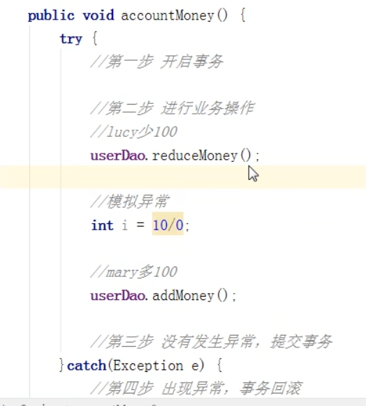

声明式事务由spring提供，底层使用是AOP

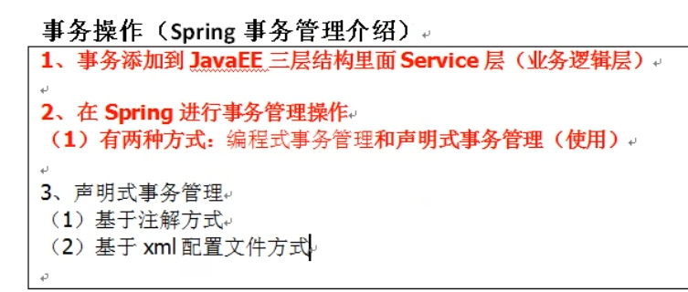

spring事务管理中

最顶层的接口是platform transaction manager

代表事务管理器 针对不同框架提供了不同实现类

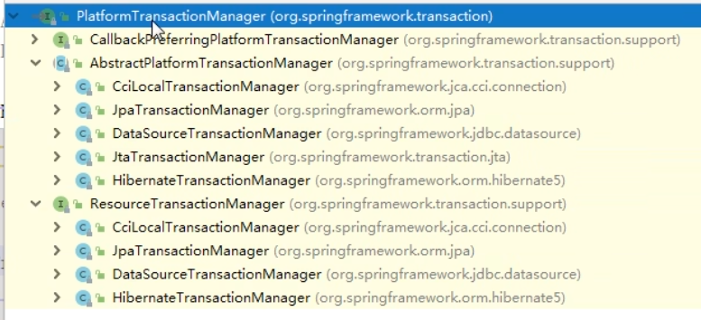

@Transaction
---

注解式的 声明式事务管理

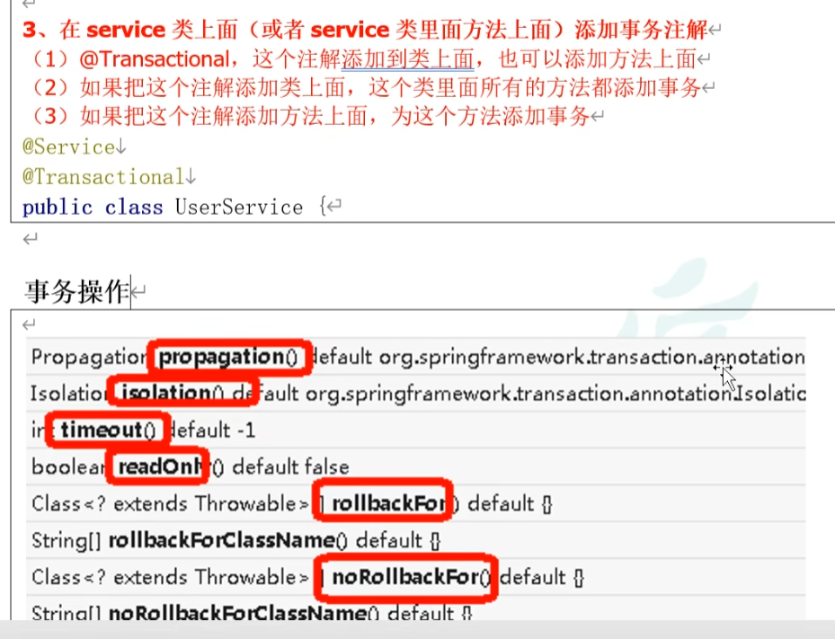

spring 事务的传播方式 7种传播方式
---

required 方法1开始事务 方法2开始事务 1调用2 方法2加入方法1事务中

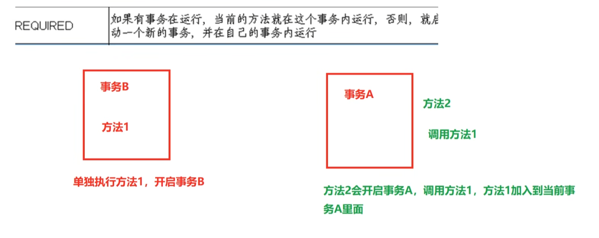

required new 方法1开始事务 方法2开始事务 1调用2 方法2完成后提交，方法1失败不影响方法2

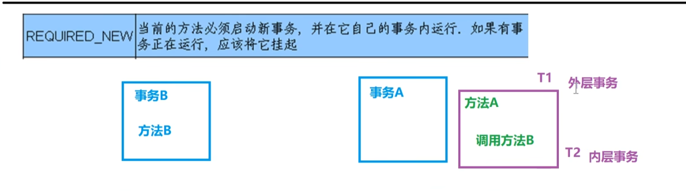

supports 

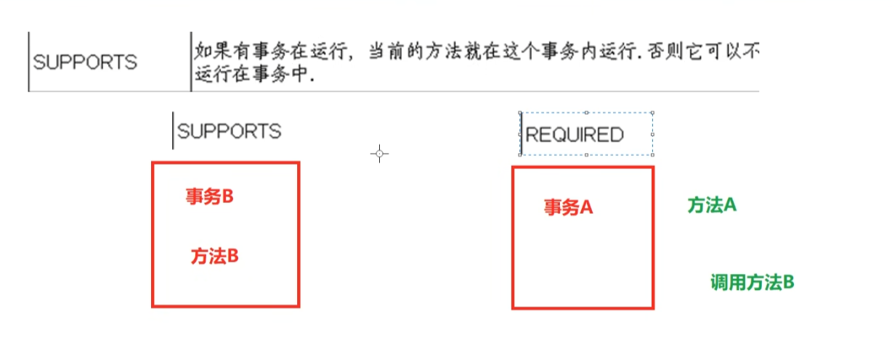

spring 事务的隔离级别
---

脏读 一个未提交的事务读到了另一个未提交的事务

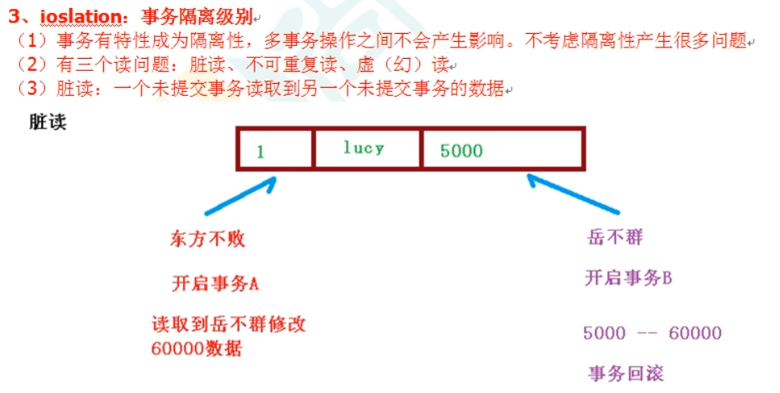

不可重复读 一个未提交事务 读取到了另一个事务已修改的数据

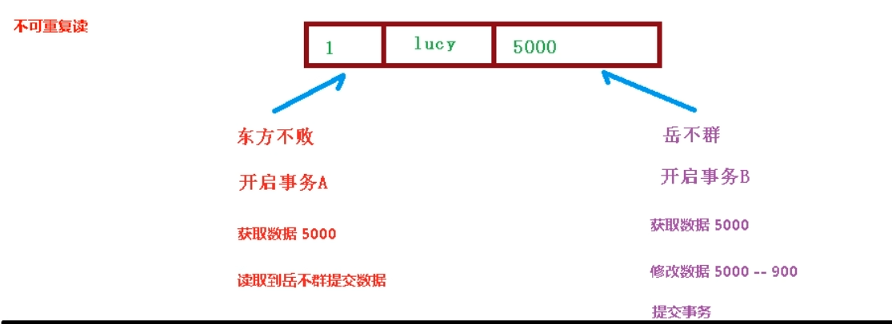

幻读 一个未提交事务读取到另一个事务新增的数据

设置事务隔离级别
---

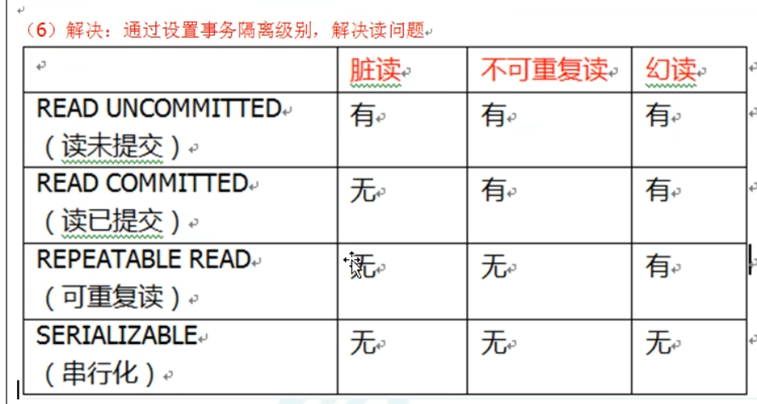

@Transaction设置传播方式和隔离级别
---

propagation po po kai xin（传播; 扩展; 宣传; 培养）

isolation ai se lei xin (隔离; 隔离状态; 孤独; 孤立状态)

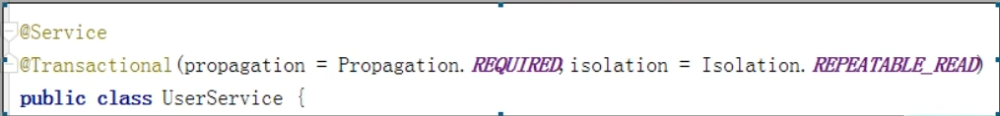

time out 超时时间
---

默认不超时

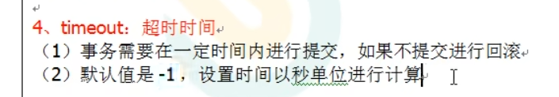

read only 是否只读
---

默认false

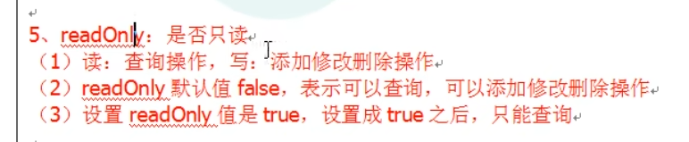

rollbackFor
---

出现什么异常 进行事务回滚

noRollbackFor
---

哪些异常不进行事务回滚