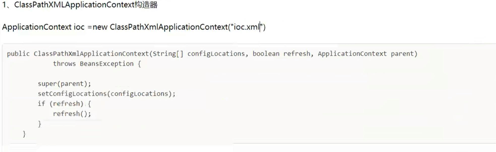
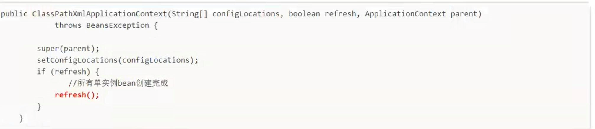
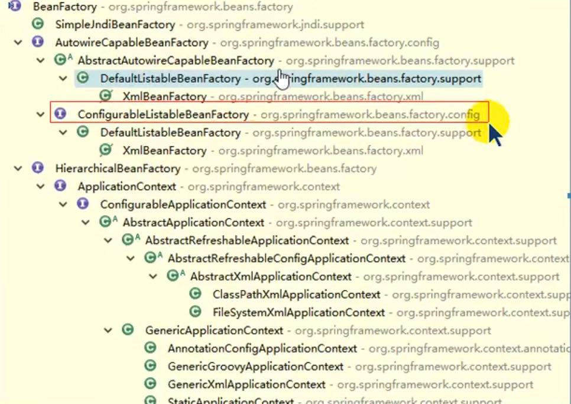
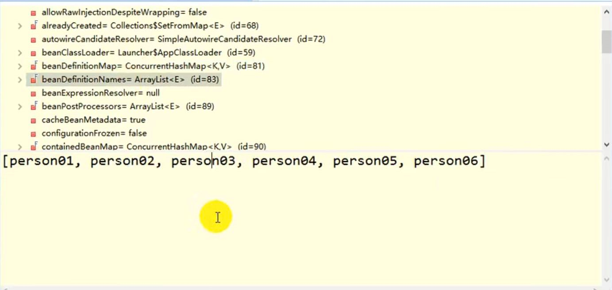

IOC的启动过程？启动期间做了什么？什么时候创建Bean？

IOC是如何创建这些单实例Bean的 并如何管理的？

ApplicationContext构造器

FileSystemXmlApplicationContext，ClassPathXmlApplicationContext等其他ApplicationContext都继承了AbstractApplicationContext，

而创建bean的过程就在 AbstractApplicationContext中的refresh()方法内部

    @Override
    public void refresh() throws BeansException, IllegalStateException {
        //上来直接同步代码块
        synchronized (this.startupShutdownMonitor) {
            // Prepare this context for refreshing.
            // 准备刷新应用上下文 如ClassPathXmlApplicationContext
            prepareRefresh();

			// Tell the subclass to refresh the internal bean factory.
            // 告诉子类刷新内部bean工厂 创建一个 ConfigurableListableBeanFactory 可配置的列表bean工厂
            // 内部将所有要创建的bean的配置信息保存起来
			ConfigurableListableBeanFactory beanFactory = obtainFreshBeanFactory();

			// Prepare the bean factory for use in this context.
            // 准备在应用上下文中使用Bean factory
			prepareBeanFactory(beanFactory);

			try {
				// Allows post-processing of the bean factory in context subclasses.
				postProcessBeanFactory(beanFactory);

				// Invoke factory processors registered as beans in the context.
				invokeBeanFactoryPostProcessors(beanFactory);

				// Register bean processors that intercept bean creation.
                // 注册后置处理器 BeanPostProcessors
				registerBeanPostProcessors(beanFactory);

				// Initialize message source for this context.
                // 支持国际化功能
				initMessageSource();

				// Initialize event multicaster for this context.
                // 初始化事件管理类
				initApplicationEventMulticaster();

				// Initialize other special beans in specific context subclasses.
                // 留给子类实现 创建不同的spring容器
				onRefresh();

				// Check for listener beans and register them.
				registerListeners();

				// Instantiate all remaining (non-lazy-init) singletons.
                //初始化所有单实例 和 不是懒加载的 bean
				finishBeanFactoryInitialization(beanFactory);

				// Last step: publish corresponding event.
                // 触发被监听的事件
				finishRefresh();
			}

			catch (BeansException ex) {
				if (logger.isWarnEnabled()) {
					logger.warn("Exception encountered during context initialization - " +
							"cancelling refresh attempt: " + ex);
				}

				// Destroy already created singletons to avoid dangling resources.
				destroyBeans();

				// Reset 'active' flag.
				cancelRefresh(ex);

				// Propagate exception to caller.
				throw ex;
			}

			finally {
				// Reset common introspection caches in Spring's core, since we
				// might not ever need metadata for singleton beans anymore...
				resetCommonCaches();
			}
		}
	}

ConfigurableListableBeanFactory 上层就是ApplicationContext 和 BeanFactory

ConfigurableListableBeanFactory结构内就有 BeanDefinition

DefaultListableBeanFactory.preInstantiateSingletons
---

    @Override
    public void preInstantiateSingletons() throws BeansException {
            if (this.logger.isDebugEnabled()) {
            this.logger.debug("Pre-instantiating singletons in " + this);
            }
    
            // Iterate over a copy to allow for init methods which in turn register new bean definitions.
            // While this may not be part of the regular factory bootstrap, it does otherwise work fine.

            //拿到所有bean的名字
            List<String> beanNames = new ArrayList<String>(this.beanDefinitionNames);
    

            // Trigger initialization of all non-lazy singleton beans...

            // 按顺序创建bean
            for (String beanName : beanNames) {

                //RootBeanDefinition拿到bean的详细信息 比如 类信息， 父类名 是否 抽象类 是否单例 懒加载等待

                RootBeanDefinition bd = getMergedLocalBeanDefinition(beanName);

                // 是单实例 不是抽象类 懒加载
                if (!bd.isAbstract() && bd.isSingleton() && !bd.isLazyInit()) {

                    是不是工厂bean 实现了FactoryBean接口
                    if (isFactoryBean(beanName)) {
                        final FactoryBean<?> factory = (FactoryBean<?>) getBean(FACTORY_BEAN_PREFIX + beanName);
                        boolean isEagerInit;
                        if (System.getSecurityManager() != null && factory instanceof SmartFactoryBean) {
                            isEagerInit = AccessController.doPrivileged(new PrivilegedAction<Boolean>() {
                                @Override
                                public Boolean run() {
                                    return ((SmartFactoryBean<?>) factory).isEagerInit();
                                }
                            }, getAccessControlContext());
                        }
                        else {
                            isEagerInit = (factory instanceof SmartFactoryBean &&
                                    ((SmartFactoryBean<?>) factory).isEagerInit());
                        }
                        if (isEagerInit) {
                            //创建bean
                            getBean(beanName);
                        }
                    }
                    else {
                        //创建bean
                        getBean(beanName);
                    }
                }
            }
    
            // Trigger post-initialization callback for all applicable beans...
            for (String beanName : beanNames) {
                Object singletonInstance = getSingleton(beanName);
                if (singletonInstance instanceof SmartInitializingSingleton) {
                    final SmartInitializingSingleton smartSingleton = (SmartInitializingSingleton) singletonInstance;
                    if (System.getSecurityManager() != null) {
                        AccessController.doPrivileged(new PrivilegedAction<Object>() {
                            @Override
                            public Object run() {
                                smartSingleton.afterSingletonsInstantiated();
                                return null;
                            }
                        }, getAccessControlContext());
                    }
                    else {
                        smartSingleton.afterSingletonsInstantiated();
                    }
                }
            }
        }

