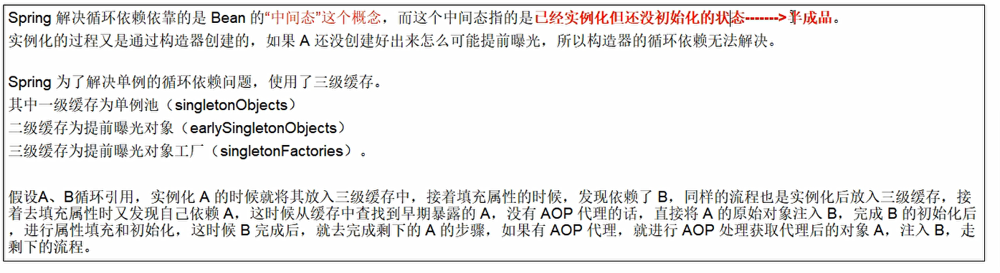

避免构造方法注入Bean

使用set方法避免循环依赖

AB循环依赖问题只要A的注入方式是singleton 就不会有循环依赖问题

prototype不支持循环依赖

在spring boot 2.6后默认禁止循环依赖

如果要开启 需要设置

    spring.main.allow-circular-references=true.

三级缓存针对的是单例（singleton）的Bean

	/** Cache of singleton objects: bean name --> bean instance */
	private final Map<String, Object> singletonObjects = new ConcurrentHashMap<String, Object>(256);

	/** Cache of early singleton objects: bean name --> bean instance */
	private final Map<String, Object> earlySingletonObjects = new HashMap<String, Object>(16);

	/** Cache of singleton factories: bean name --> ObjectFactory */
	private final Map<String, ObjectFactory<?>> singletonFactories = new HashMap<String, ObjectFactory<?>>(16);

singletonObjects 完整的对象

earlySingletonObjects 半成品未set属性的对象（提前暴露的对象，如果是构造器注入，对象还没有创建实例化都放不进三级缓存，更不可能提前曝光）

singletonFactories bean工厂类（提前暴露的对象工厂）

