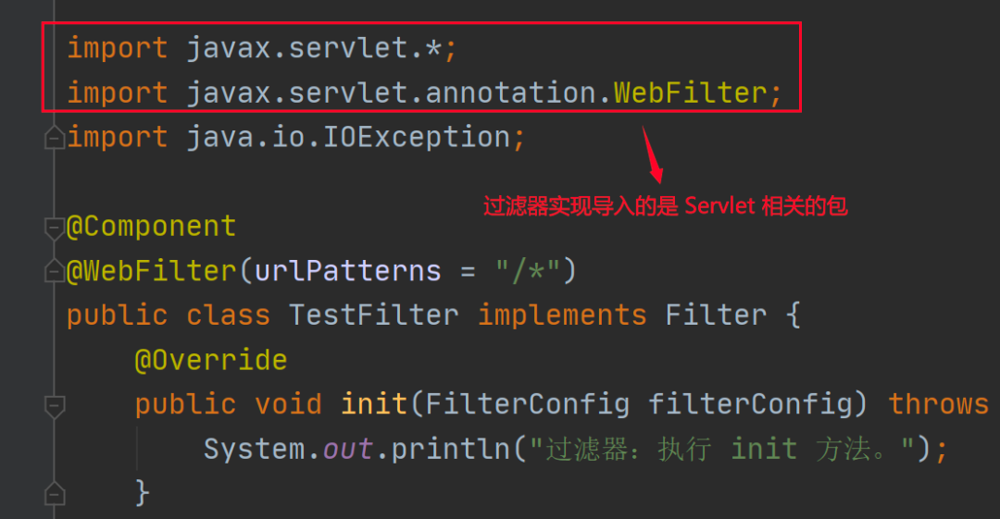
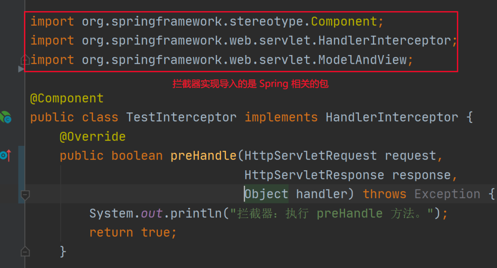
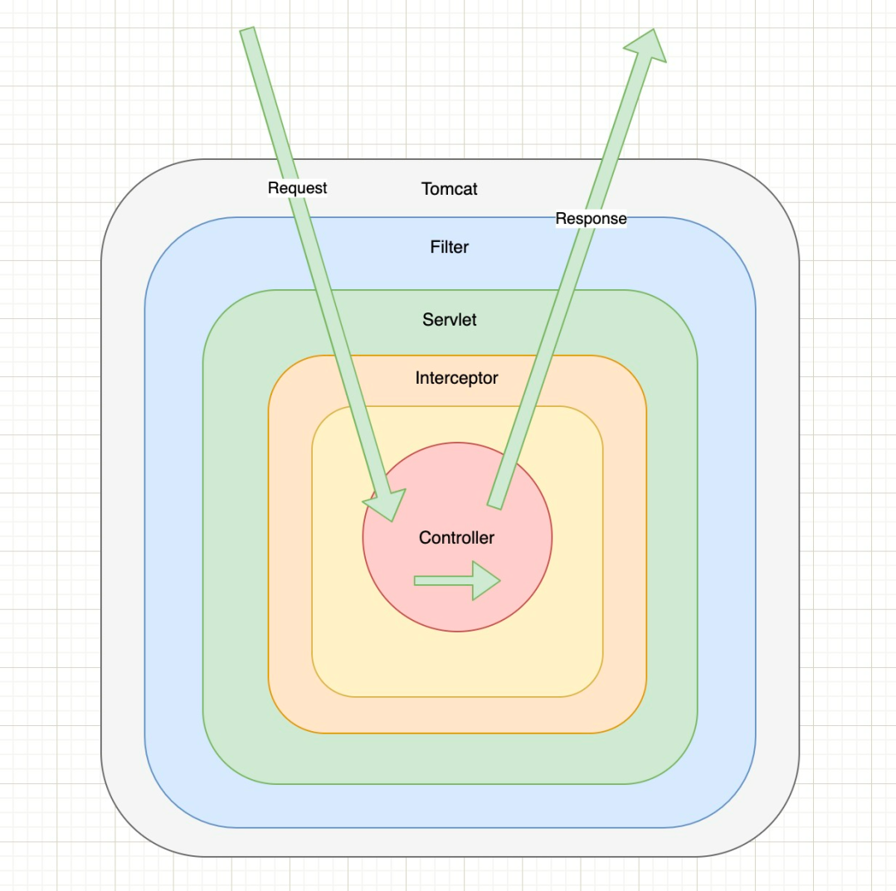
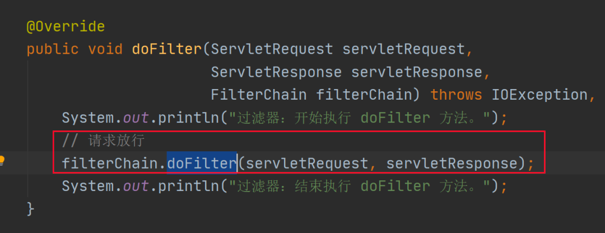
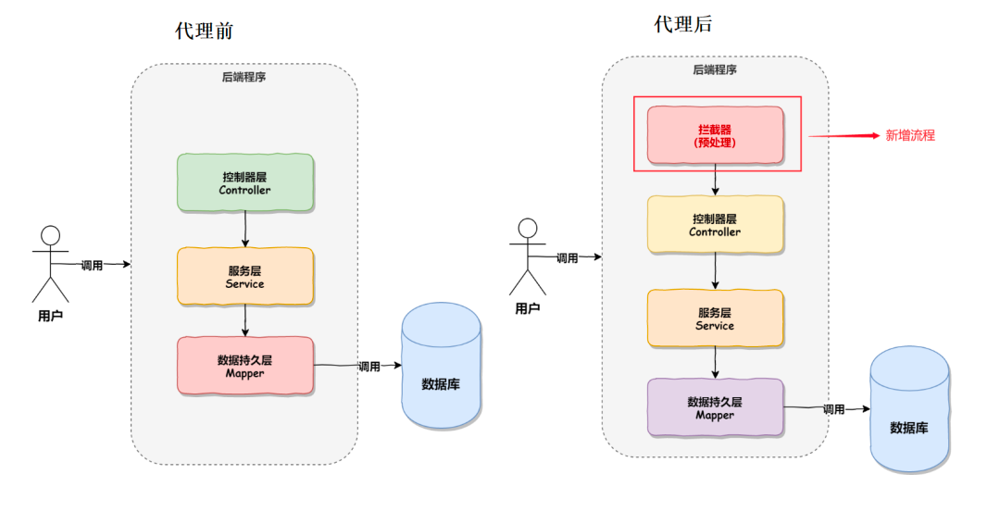
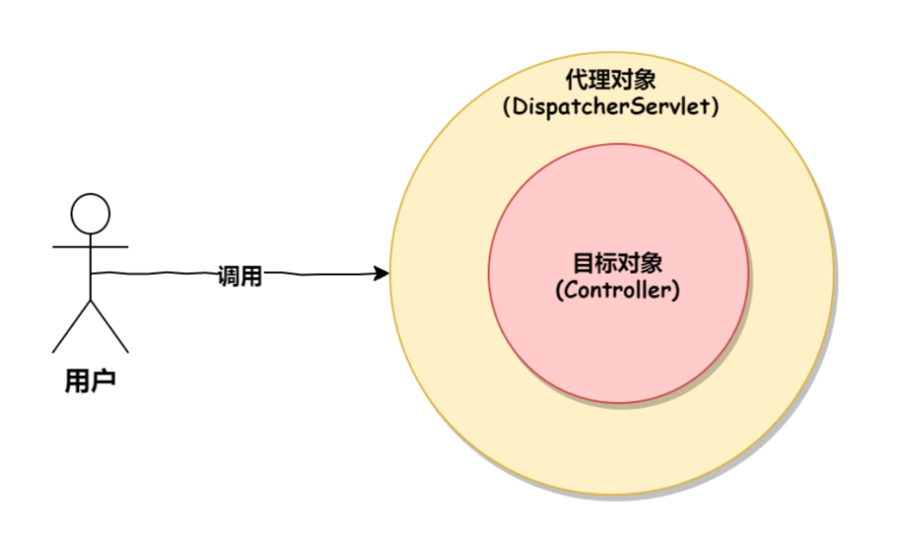

过滤器（Filter）和拦截器（Interceptor）都是基于 AOP（Aspect Oriented Programming，

面向切面编程）思想实现的，用来解决项目中某一类问题的两种“工具”，但二者有着明显的差距。

过滤器来自于 Servlet，而拦截器来自于 Spring 框架，从上面代码中我们也可以看出，

出身不同
---

过滤器在实现时导入的是 Servlet 相关的包，如下图所示：

而拦截器在实现时，导入的是 Spring 相关的包，如下图所示：

触发时机不同
---

请求的执行顺序是：

请求进入容器 > 进入过滤器 > 进入 Servlet > 进入拦截器 > 执行控制器（Controller），如下图所示：

所以过滤器和拦截器的执行时机也是不同的，

过滤器会先执行，然后才会执行拦截器，最后才会进入真正的要调用的方法。

实现不同
---

过滤器是基于方法回调实现的，我们在上面实现过滤器的时候就会发现，

当我们要执行下一个过滤器或下一个流程时，需要调用 FilterChain 对象的 doFilter 方法进行回调执行，如下图所示：

由此可以看出，过滤器的实现是基于方法回调的。而拦截器是基于动态代理（底层是反射）实现的，它的实现如下图所示：

代理调用的效果如下图所示：

支持的项目类型不同
---

过滤器是 Servlet 规范中定义的，所以过滤器要依赖 Servlet 容器，它只能用在 Web 项目中；

而拦截器是 Spring 中的一个组件，因此拦截器既可以用在 Web 项目中，同时还可以用在 Application 或 Swing 程序中。

使用的场景不同
---

因为拦截器更接近业务系统，所以拦截器主要用来实现项目中的业务判断的，

比如：登录判断、权限判断、日志记录等业务。

而过滤器通常是用来实现通用功能过滤的，比如：敏感词过滤、字符集编码设置、响应数据压缩等功能。

