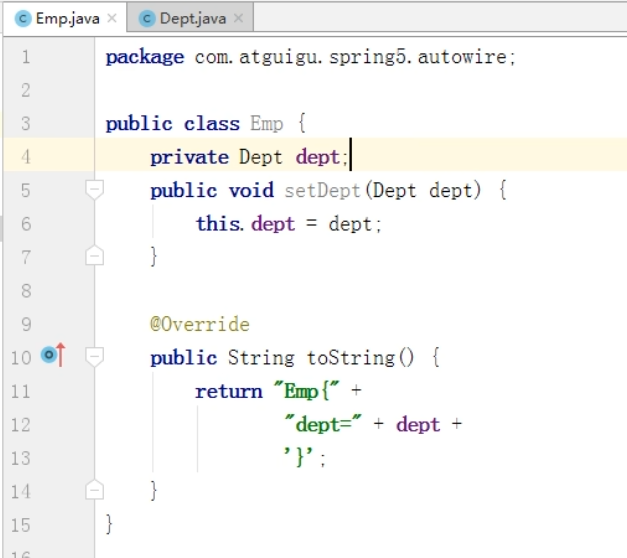
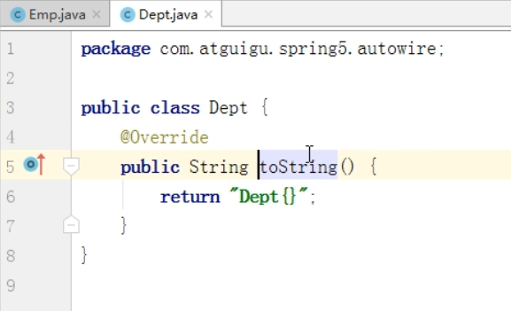
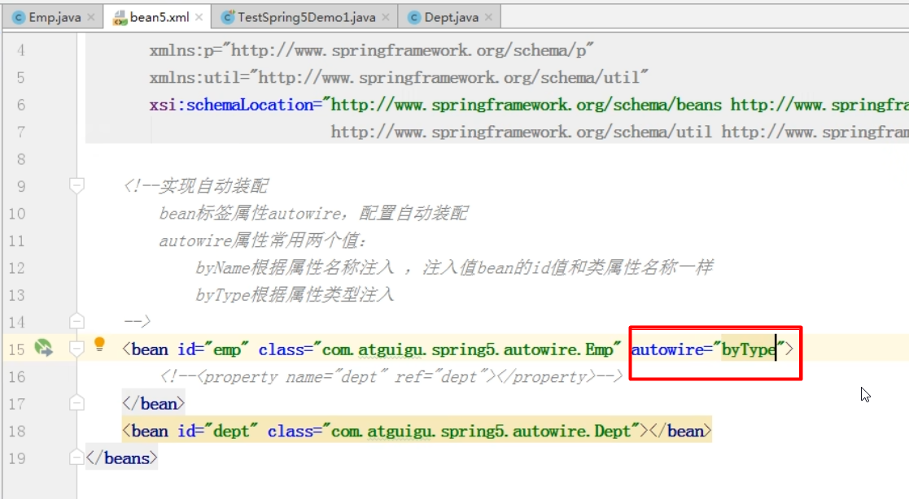
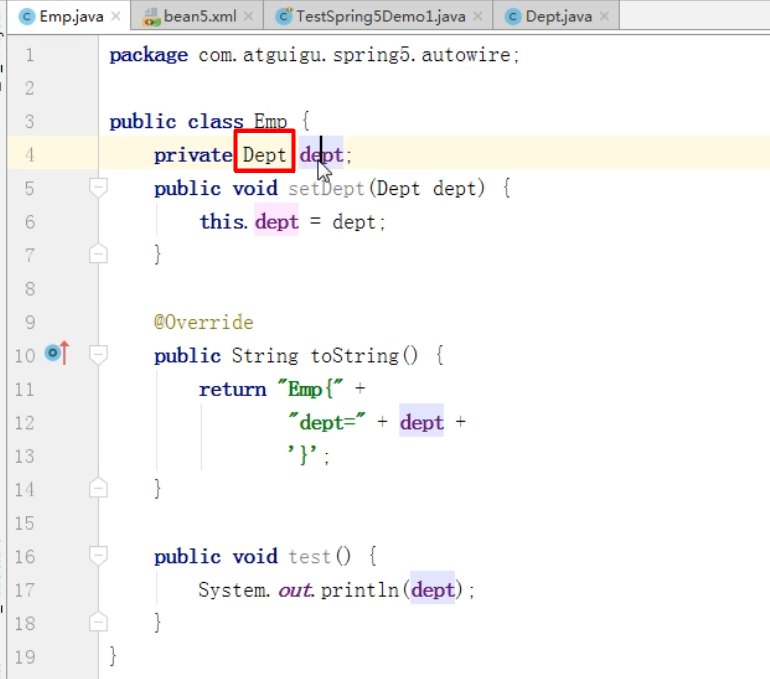
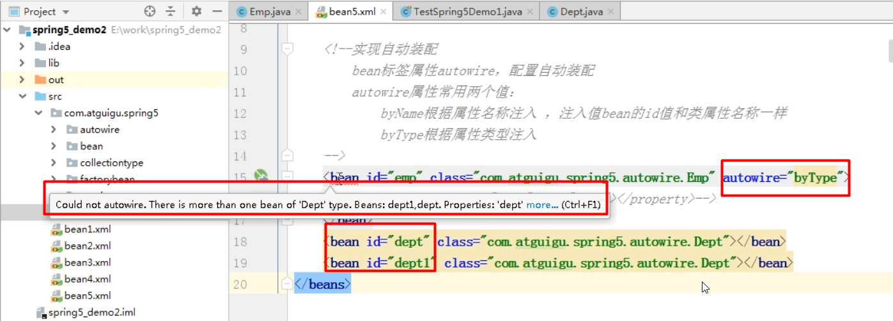

什么是自动装配
---

根据指定装配规则（属性名称或者属性类型）

上面的就是手动装配

如何实现自动装配
---

通过bean标签中的autowire实现

autowire中有两个属性 byName通过属性名来注入，byType通过属性类型注入

**byName的方式注入值bean的id和类中的属性的名称要一样**

**byType的方式注入值bean的类型和类中的属性的类型要一样**

注意
---
如果根据类型注入 多个同类型的不同名称的bean注入，编译就会报错

