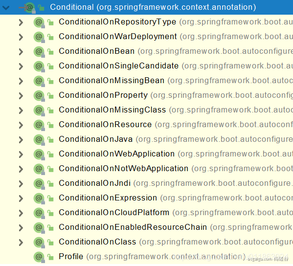

@Bean、@Component、@Controller、@Service、@Repository，

它们是Spring的基本标签，在Spring Boot中并未改变它们原来的功能。

@Import
---

@Import({User.class, DBHelper.class})

给容器中`自动创建`出这两个类型的组件、默认组件的名字就是`全类名` 包路径 + 类名

    @Import({User.class, DBHelper.class})
    @Configuration(proxyBeanMethods = false) //告诉SpringBoot这是一个配置类 == 配置文件
    public class MyConfig {
    }

测试类

    //1、返回我们IOC容器
    ConfigurableApplicationContext run = SpringApplication.run(MainApplication.class, args);
    
    //...
    
    //5、获取组件
    String[] beanNamesForType = run.getBeanNamesForType(User.class);
    
    for (String s : beanNamesForType) {
    System.out.println(s);
    }
    
    DBHelper bean1 = run.getBean(DBHelper.class);
    System.out.println(bean1);

@Conditional
---

条件装配：满足Conditional指定的条件，则进行组件注入

可以用在方法上 也可以用在类上

用@ConditionalOnMissingBean举例说明

    @Configuration(proxyBeanMethods = false)
    @ConditionalOnMissingBean(name = "tom")//没有tom名字的Bean时，MyConfig类的Bean才能生效。
    public class MyConfig {
    ....

@ImportResource
---

@ImportResource导入Spring配置文件

公司使用bean.xml文件生成配置bean，

然而你为了省事，想继续复用bean.xml，@ImportResource粉墨登场

bean.xml

    <?xml version="1.0" encoding="UTF-8"?>
    <beans ...">
    
        <bean id="haha" class="com.lun.boot.bean.User">
            <property name="name" value="zhangsan"></property>
            <property name="age" value="18"></property>
        </bean>
    
        <bean id="hehe" class="com.lun.boot.bean.Pet">
            <property name="name" value="tomcat"></property>
        </bean>
    </beans>

配置类 使用 @ImportResource

    @ImportResource("classpath:beans.xml")
    public class MyConfig {
    ...
    }

测试类

    public static void main(String[] args) {
    //1、返回我们IOC容器
    ConfigurableApplicationContext run = SpringApplication.run(MainApplication.class, args);
    
        boolean haha = run.containsBean("haha");
        boolean hehe = run.containsBean("hehe");
        System.out.println("haha："+haha);//true
        System.out.println("hehe："+hehe);//true
    }