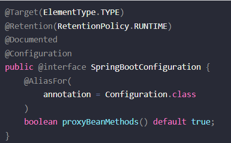
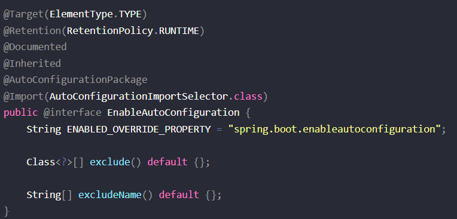
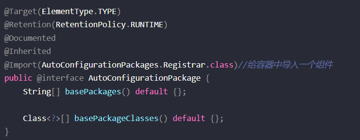
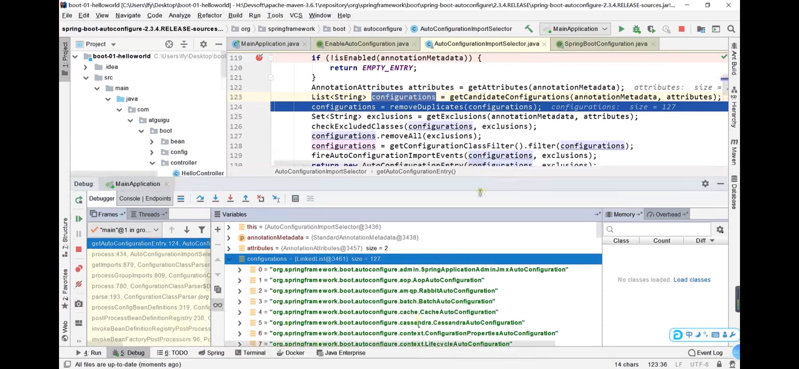

分析下@SpringBootApplication

    @Target(ElementType.TYPE)
    @Retention(RetentionPolicy.RUNTIME)
    @Documented
    @Inherited
    @SpringBootConfiguration
    @EnableAutoConfiguration
    @ComponentScan(
        excludeFilters = {@Filter(
        type = FilterType.CUSTOM,
        classes = {TypeExcludeFilter.class}
    ), @Filter(
    type = FilterType.CUSTOM,
    classes = {AutoConfigurationExcludeFilter.class}
    )}
    )
    public @interface SpringBootApplication {
    ...
    }

重点分析@SpringBootConfiguration，@EnableAutoConfiguration，@ComponentScan。

@SpringBootConfiguration
----

里面有@Configuration代表当前是一个配置类。

@ComponentScan
---

指定扫描路径

@EnableAutoConfiguration
---

重点分析@AutoConfigurationPackage，@Import(AutoConfigurationImportSelector.class)。

@AutoConfigurationPackage
---

自动配置包

AutoConfigurationPackage.Register.class

利用register给容器导入一系列组件 把主方法所在的包的组件批量导入容器

@Import(AutoConfigurationImportSelector.class)
---

1   利用getAutoConfigurationEntry(annotationMetadata);给容器中批量导入一些组件

2   调用List<String> configurations = getCandidateConfigurations(annotationMetadata, attributes)获取到所有需要导入到容器中的配置类

3   利用工厂加载 Map<String, List<String>> loadSpringFactories(@Nullable ClassLoader classLoader);得到所有的组件

4   从META-INF/spring.factories位置来加载一个文件

    默认扫描我们当前系统里面所有META-INF/spring.factories位置的文件

    spring-boot-autoconfigure.jar包里面也有META-INF/spring.factories 所有spring boot 生态的包配置文件类都在里面

虽然我们100多个个场景的所有自动配置启动的时候默认全部加载，但是xxxxAutoConfiguration按照条件装配规则（@Conditional），最终会按需配置。

如AopAutoConfiguration类 matchIfMissing默认开启

    @Configuration(
    proxyBeanMethods = false
    )
    @ConditionalOnProperty(
    prefix = "spring.aop",
    name = "auto",
    havingValue = "true",
    matchIfMissing = true
    )
    public class AopAutoConfiguration {
        public AopAutoConfiguration() {
        }
        ...
    }

自动配置流程
---

以DispatcherServletAutoConfiguration的内部类DispatcherServletConfiguration为例子:

    @Bean
    @ConditionalOnBean(MultipartResolver.class)  //容器中有这个类型组件
    @ConditionalOnMissingBean(name = DispatcherServlet.MULTIPART_RESOLVER_BEAN_NAME) //容器中没有这个名字 multipartResolver 的组件
    public MultipartResolver multipartResolver(MultipartResolver resolver) {
        //给@Bean标注的方法传入了对象参数，这个参数的值就会从容器中找。
        //SpringMVC multipartResolver。防止有些用户配置的文件上传解析器不符合规范
        // Detect if the user has created a MultipartResolver but named it incorrectly
        return resolver;//给容器中加入了文件上传解析器；
    }

SpringBoot默认会在底层配好所有的组件，但是如果用户自己配置了以用户的优先。