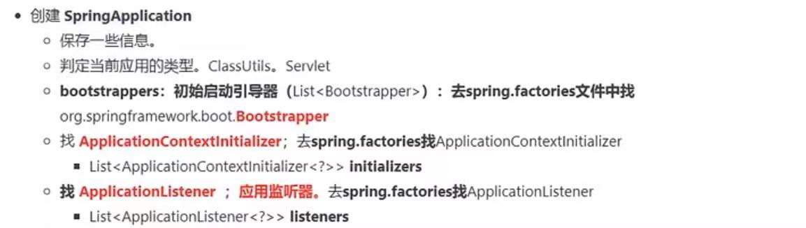

Spring Boot 启动过程

1 创建SpringApplication

public class SpringApplication {

    ...
    
	public static ConfigurableApplicationContext run(Class<?> primarySource, String... args) {
		return run(new Class<?>[] { primarySource }, args);
	}
    
    public static ConfigurableApplicationContext run(Class<?>[] primarySources, String[] args) {
		return new SpringApplication(primarySources).run(args);
	}
    
    //先看看new SpringApplication(primarySources)，下一节再看看run()
	public SpringApplication(Class<?>... primarySources) {
		this(null, primarySources);
	}
    
    public SpringApplication(ResourceLoader resourceLoader, Class<?>... primarySources) {
		//资源加载器
        this.resourceLoader = resourceLoader;
		//主配置类
        Assert.notNull(primarySources, "PrimarySources must not be null");
		this.primarySources = new LinkedHashSet<>(Arrays.asList(primarySources));
        //WebApplicationType是枚举类，有NONE,SERVLET,REACTIVE,下行webApplicationType是SERVLET
		this.webApplicationType = WebApplicationType.deduceFromClasspath();
        
        //初始启动引导器，去spring.factories文件中找org.springframework.boot.Bootstrapper，但我找不到实现Bootstrapper接口的类
		this.bootstrappers = new ArrayList<>(getSpringFactoriesInstances(Bootstrapper.class));
		
        //去spring.factories找 ApplicationContextInitializer
        setInitializers((Collection) getSpringFactoriesInstances(ApplicationContextInitializer.class));
		
        //去spring.factories找 ApplicationListener
        setListeners((Collection) getSpringFactoriesInstances(ApplicationListener.class));

        this.mainApplicationClass = deduceMainApplicationClass();
	}
 	
    private Class<?> deduceMainApplicationClass() {
		try {
			StackTraceElement[] stackTrace = new RuntimeException().getStackTrace();
			for (StackTraceElement stackTraceElement : stackTrace) {
				if ("main".equals(stackTraceElement.getMethodName())) {
					return Class.forName(stackTraceElement.getClassName());
				}
			}
		}
		catch (ClassNotFoundException ex) {
			// Swallow and continue
		}
		return null;
	}
    
    ...

}
