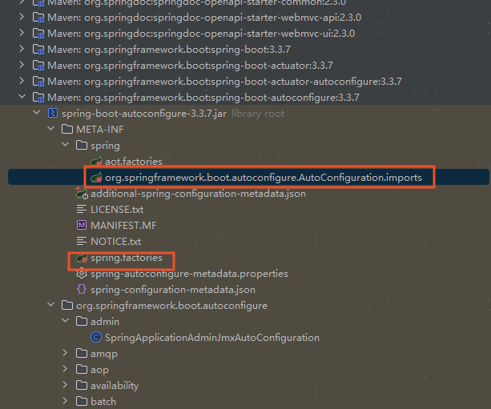

在 Spring Boot 3.0 中，使用 spring.factories 来注册“自动配置类”（Auto-Configuration）的方式已经被正式移除。

虽然 spring.factories 文件本身并没有完全消失（它仍然用于注册 ApplicationListener、EnvironmentPostProcessor 等其他组件），但对于自动配置（EnableAutoConfiguration），你必须切换到新的 SPI 机制。




# 旧方式

```properties
org.springframework.boot.autoconfigure.EnableAutoConfiguration=\
com.example.config.MyFirstAutoConfiguration,\
com.example.config.MySecondAutoConfiguration
```

# 新方式 (Imports 文件)

```properties
com.example.config.MyFirstAutoConfiguration
com.example.config.MySecondAutoConfiguration
```

# 为什么要改？

这个改动主要是为了拥抱 Spring Native (GraalVM) 和 AOT (Ahead-of-Time) 编译优化：

## AOT 友好：

旧的 spring.factories 是一个巨大的 Key-Value 映射，

包含了各种类型的配置（监听器、过滤器、自动配置等）。为了做 AOT 优化，

Spring 需要精确地知道哪些是“配置类”。拆分出独立的 .imports 文件让解析器能更高效、更明确地找到自动配置类。

## 避免冲突：

旧文件在合并多个 jar 包时（shade/fat jar），处理同名文件合并比较麻烦（需要特殊处理追加内容）。

新格式按行读取，逻辑更简单。