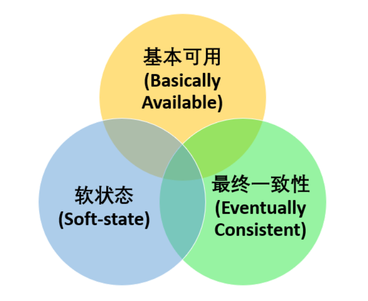

BASE 理论三要素

基本可用
---
基本可用是指分布式系统在出现不可预知故障的时候，允许损失部分可用性。但是，这绝不等价于系统不可用。

什么叫允许损失部分可用性呢？

响应时间上的损失: 正常情况下，处理用户请求需要 0.5s 返回结果，但是由于系统出现故障，处理用户请求的时间变为 3 s。

系统功能上的损失：正常情况下，用户可以使用系统的全部功能，但是由于系统访问量突然剧增，系统的部分非核心功能无法使用。

软状态
---
软状态指允许系统中的数据存在中间状态（CAP 理论中的数据不一致），并认为该中间状态的存在不会影响系统的整体可用性，即允许系统在不同节点的数据副本之间进行数据同步的过程存在延时。

最终一致性
---

最终一致性强调的是系统中所有的数据副本，在经过一段时间的同步后，最终能够达到一个一致的状态。因此，最终一致性的本质是需要系统保证最终数据能够达到一致，而不需要实时保证系统数据的强一致性。

分布式一致性的 3 种级别：

    强一致性 ：系统写入了什么，读出来的就是什么。
    
    弱一致性 ：不一定可以读取到最新写入的值，也不保证多少时间之后读取到的数据是最新的，只是会尽量保证某个时刻达到数据一致的状态。
    
    最终一致性 ：弱一致性的升级版，系统会保证在一定时间内达到数据一致的状态。

业界比较推崇是最终一致性级别，但是某些对数据一致要求十分严格的场景比如银行转账还是要保证强一致性。

那实现最终一致性的具体方式是什么呢? 《分布式协议与算法实战》 中是这样介绍：

读时修复 : 在读取数据时，检测数据的不一致，进行修复。比如 Cassandra 的 Read Repair 实现，具体来说，在向 Cassandra 系统查询数据的时候，如果检测到不同节点的副本数据不一致，系统就自动修复数据。

写时修复 : 在写入数据，检测数据的不一致时，进行修复。比如 Cassandra 的 Hinted Handoff 实现。具体来说，Cassandra 集群的节点之间远程写数据的时候，如果写失败 就将数据缓存下来，然后定时重传，修复数据的不一致性。

异步修复 : 这个是最常用的方式，通过定时对账检测副本数据的一致性，并修复。
比较推荐 写时修复，这种方式对性能消耗比较低。