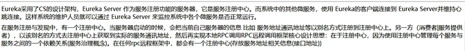

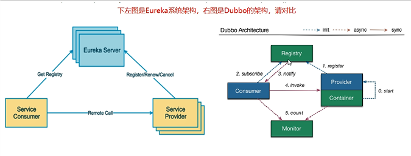

eureka client 和 eureka server
---

client是客户端包，在业务项目中依赖该包，和server进行交互

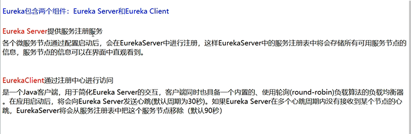

1.X和2.X的对比说明
---

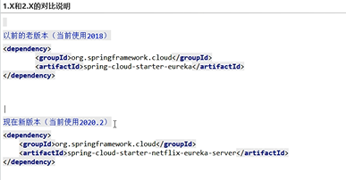

@EnableEurekaServer 服务端
---

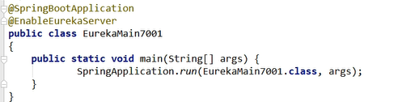

@EnableEurekaClient 客户端
---

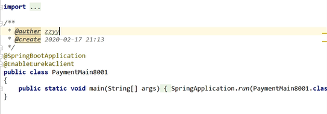
 
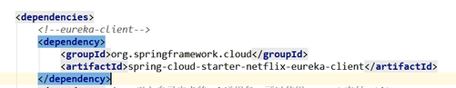

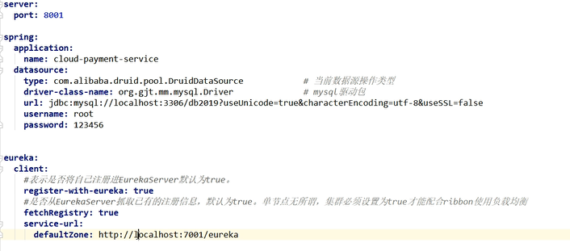

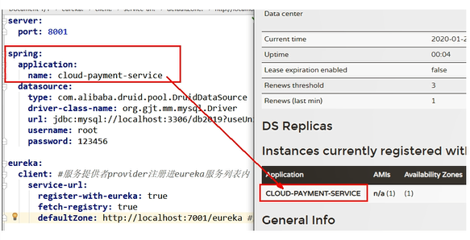

Eureka注册中心原理
---

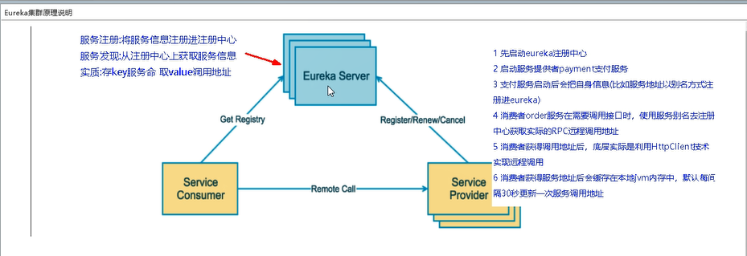

@LoadBalanced 结合RestTemplate
---

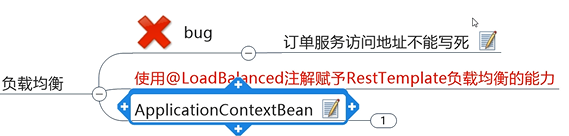

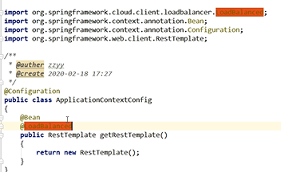

@Eureka的自我保护机制
---

概述
保护模式主要用于一组客户端和Eureka Server之间存在网络分区场景下的保护。

一旦进入保护模式， Eureka Server将会尝试保护其服务注册表中的信息，

不再删除服务注册表中的数据，也就是不会注销任何微服务。

如果在Eureka Server的首页看到以下这段提示，则说明Eureka进入了保护模式：
 
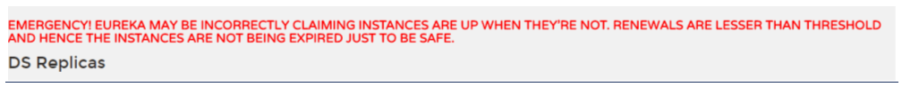

关闭自我保护机制
---

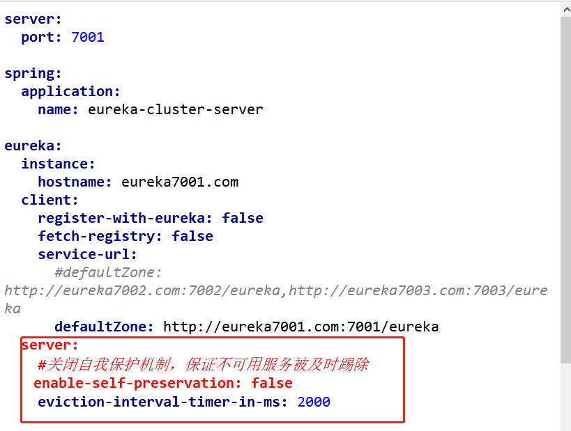
  
  
 
 
 

