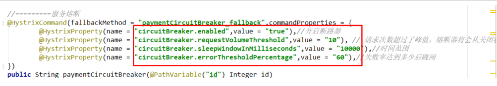
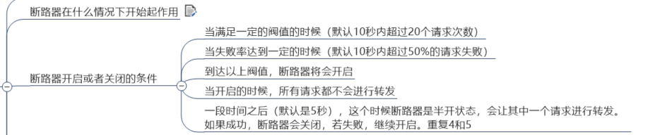

熔断类型：
---

熔断打开
---

请求不再进行调用当前服务，内部设置时钟一般为MTTR（平均故障处理时间)，当打开时长达到所设时钟则进入半熔断状态

熔断关闭
---

熔断关闭不会对服务进行熔断

熔断半开
---

部分请求根据规则调用当前服务，如果请求成功且符合规则则认为当前服务恢复正常，关闭熔断

断路器在什么情况下起作用
---

涉及到断路器的三个重要参数：快照时间窗、请求总数阀值、错误百分比阀值。
1：快照时间窗：断路器确定是否打开需要统计一些请求和错误数据，而统计的时间范围就是快照时间窗，默认为最近的10秒。

2：请求总数阀值：在快照时间窗内，必须满足请求总数阀值才有资格熔断。默认为20，意味着在10秒内，如果该hystrix命令的调用次数不足20次，即使所有的请求都超时或其他原因失败，断路器都不会打开。

3：错误百分比阀值：当请求总数在快照时间窗内超过了阀值，比如发生了30次调用，如果在这30次调用中，有15次发生了超时异常，也就是超过50%的错误百分比，在默认设定50%阀值情况下，这时候就会将断路器打开。

断路器开启或者关闭的条件
---

断路器打开之后
---

1：再有请求调用的时候，将不会调用主逻辑，而是直接调用降级fallback。通过断路器，实现了自动地发现错误并将降级逻辑切换为主逻辑，减少响应延迟的效果。

2：原来的主逻辑要如何恢复呢？

对于这一问题，hystrix也为我们实现了自动恢复功能。

当断路器打开，对主逻辑进行熔断之后，hystrix会启动一个休眠时间窗，在这个时间窗内，降级逻辑是临时的成为主逻辑，

当休眠时间窗到期，断路器将进入半开状态，释放一次请求到原来的主逻辑上，如果此次请求正常返回，那么断路器将继续闭合，

主逻辑恢复，如果这次请求依然有问题，断路器继续进入打开状态，休眠时间窗重新计时。