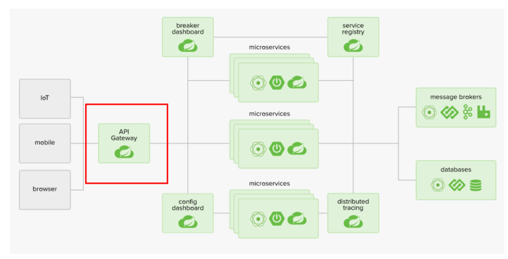
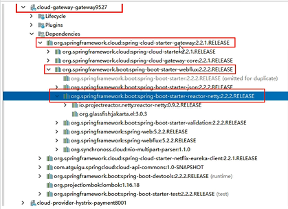
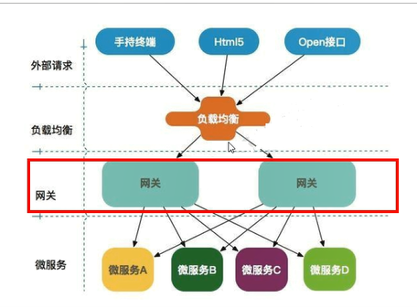
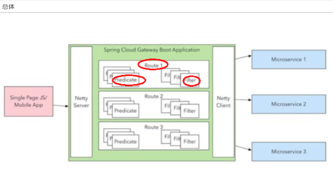
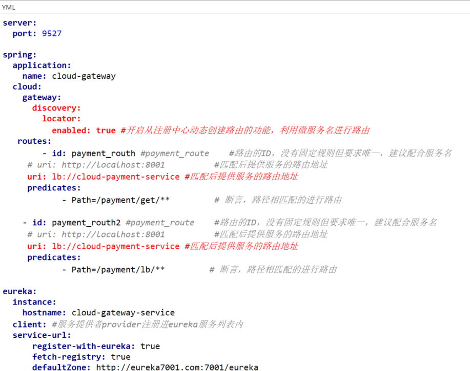

Cloud全家桶中有个很重要的组件就是网关，在1.x版本中都是采用的Zuul网关；

但在2.x版本中，zuul的升级一直跳票，SpringCloud最后自己研发了一个网关替代Zuul，

那就是SpringCloud Gateway一句话：gateway是原zuul1.x版的替代

SpringCloud Gateway 是 Spring Cloud 的一个全新项目，基于 Spring 5.0+Spring Boot 2.0 和 Project Reactor 等技术开发的网关，它旨在为微服务架构提供一种简单有效的统一的 API 路由管理方式。

SpringCloud Gateway 作为 Spring Cloud 生态系统中的网关，目标是替代 Zuul，在Spring Cloud 2.0以上版本中，没有对新版本的Zuul 2.0以上最新高性能版本进行集成，仍然还是使用的Zuul 1.x非Reactor模式的老版本。而为了提升网关的性能，SpringCloud Gateway是基于WebFlux框架实现的，而WebFlux框架底层则使用了高性能的Reactor模式通信框架Netty。

Spring Cloud Gateway的目标提供统一的路由方式且基于 Filter 链的方式提供了网关基本的功能，例如：安全，监控/指标，和限流。

微服务架构中网关在什么位置？
---

Route(路由) Predicate(断言) Filter(过滤)
---

路由是构建网关的基本模块，它由ID，目标URI，一系列的断言和过滤器组成，如果断言为true则匹配该路由

参考的是Java8的java.util.function.Predicate
开发人员可以匹配HTTP请求中的所有内容(例如请求头或请求参数)，如果请求与断言相匹配则进行路由

指的是Spring框架中GatewayFilter的实例，使用过滤器，可以在请求被路由前或者之后对请求进行修改。

web请求，通过一些匹配条件，定位到真正的服务节点。并在这个转发过程的前后，进行一些精细化控制。
predicate就是我们的匹配条件；
而filter，就可以理解为一个无所不能的拦截器。有了这两个元素，再加上目标uri，就可以实现一个具体的路由了

动态路由
---

默认情况下Gateway会根据注册中心注册的服务列表，

以注册中心上微服务名为路径创建动态路由进行转发，从而实现动态路由的功能

示例YML配置文件
---

