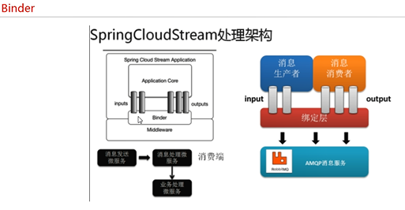
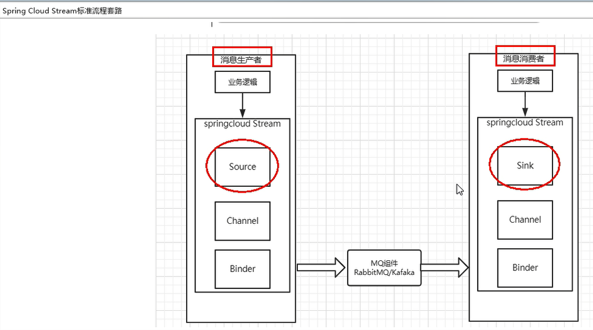

屏蔽底层消息中间件的差异,降低切换成本，统一消息的编程模型
---

stream凭什么可以统一底层差异
---
在没有绑定器这个概念的情况下，我们的SpringBoot应用要直接与消息中间件进行信息交互的时候，
由于各消息中间件构建的初衷不同，它们的实现细节上会有较大的差异性
通过定义绑定器作为中间层，完美地实现了应用程序与消息中间件细节之间的隔离。
通过向应用程序暴露统一的Channel通道，使得应用程序不需要再考虑各种不同的消息中间件实现。

通过定义绑定器Binder作为中间层，实现了应用程序与消息中间件细节之间的隔离。

Binder
---

在没有绑定器这个概念的情况下，我们的SpringBoot应用要直接与消息中间件进行信息交互的时候，

由于各消息中间件构建的初衷不同，它们的实现细节上会有较大的差异性，通过定义绑定器作为中间层，完美地实现了应用程序与消息中间件细节之间的隔离。Stream对消息中间件的进一步封装，可以做到代码层面对中间件的无感知，甚至于动态的切换中间件(rabbitmq切换为kafka)，使得微服务开发的高度解耦，服务可以关注更多自己的业务流程

通过定义绑定器Binder作为中间层，实现了应用程序与消息中间件细节之间的隔离。

Binder可以生成Binding，Binding用来绑定消息容器的生产者和消费者，它有两种类型，INPUT和OUTPUT，INPUT对应于消费者，OUTPUT对应于生产者。

input和output
---

  