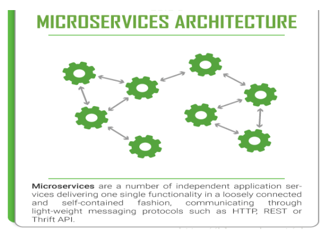
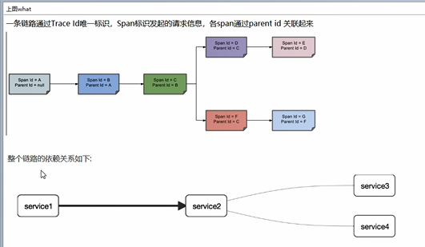

在微服务框架中，一个由客户端发起的请求在后端系统中会经过多个不同的的服务节点调用来协同产生最后的请求结果，每一个前段请求都会形成一条复杂的分布式服务调用链路，链路中的任何一环出现高延时或错误都会引起整个请求最后的失败。

TraceId和Span
---

Trace:类似于树结构的Span集合，表示一条调用链路，存在唯一标识

span:表示调用链路来源，通俗的理解span就是一次请求信息