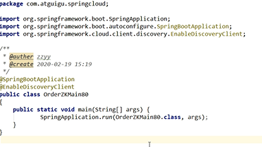
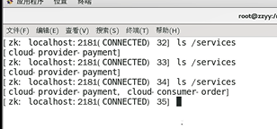

启动类
---

SpringBoot整合zookeeper客户端
---

        <dependency>
            <groupId>org.springframework.cloud</groupId>
            <artifactId>spring-cloud-starter-zookeeper-discovery</artifactId>
        </dependency>

YML配置
---

查看注册的服务 ls /services
---

