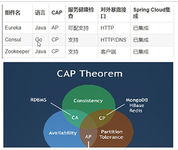
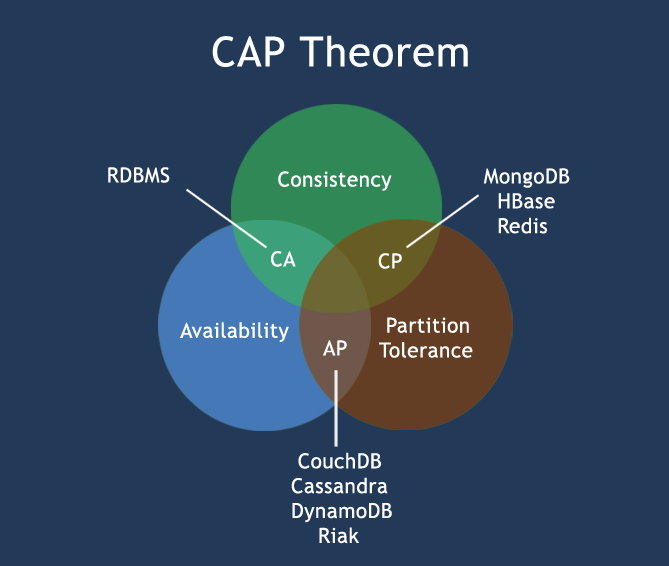

三个注册中心异同点
---

常见的可以作为注册中心的组件有：ZooKeeper、Eureka、Nacos...。

ZooKeeper 保证的是 CP。 任何时刻对 ZooKeeper 的读请求都能得到一致性的结果，但是， ZooKeeper 不保证每次请求的可用性比如在 Leader 选举过程中或者半数以上的机器不可用的时候服务就是不可用的。

Eureka 保证的则是 AP。 Eureka 在设计的时候就是优先保证 A （可用性）。在 Eureka 中不存在什么 Leader 节点，每个节点都是一样的、平等的。因此 Eureka 不会像 ZooKeeper 那样出现选举过程中或者半数以上的机器不可用的时候服务就是不可用的情况。 Eureka 保证即使大部分节点挂掉也不会影响正常提供服务，只要有一个节点是可用的就行了。只不过这个节点上的数据可能并不是最新的。

Nacos 不仅支持 CP 也支持 AP。

C:Consistency（强一致性）

A:Availability（可用性）

P:Partition tolerance（分区容错性）

CAP理论关注粒度是数据，而不是整体系统设计的策略

最多只能同时较好的满足两个。

CAP理论的核心是：一个分布式系统不可能同时很好的满足一致性，可用性和分区容错性这三个需求，

因此，根据 CAP 原理将 NoSQL 数据库分成了满足 CA 原则、满足 CP 原则和满足 AP 原则三 大类：

    CA - 单点集群，满足一致性，可用性的系统，通常在可扩展性上不太强大。
    
    CP - 满足一致性，分区容忍必的系统，通常性能不是特别高。
    
    AP - 满足可用性，分区容忍性的系统，通常可能对一致性要求低一些。

