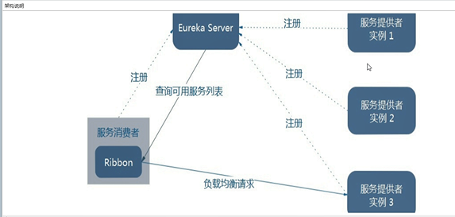

常见的负载均衡有软件Nginx，LVS，硬件 F5等。

Ribbon本地负载均衡客户端 VS Nginx服务端负载均衡区别
---

Nginx是服务器负载均衡，客户端所有请求都会交给nginx，

然后由nginx实现转发请求。即负载均衡是由服务端实现的。

Ribbon本地负载均衡，在调用微服务接口时候，

会在注册中心上获取注册信息服务列表之后缓存到JVM本地，

从而在本地实现RPC远程服务调用技术。

集中式负载均衡和进程内负载均衡
---

集中式LB

即在服务的消费方和提供方之间使用独立的LB设施(可以是硬件，如F5, 也可以是软件，如nginx), 

由该设施负责把访问请求通过某种策略转发至服务的提供方；

进程内LB

将LB逻辑集成到消费方，消费方从服务注册中心获知有哪些地址可用，

然后自己再从这些地址中选择出一个合适的服务器。

Ribbon就属于进程内LB，它只是一个类库，

集成于消费方进程，消费方通过它来获取到服务提供方的地址。

