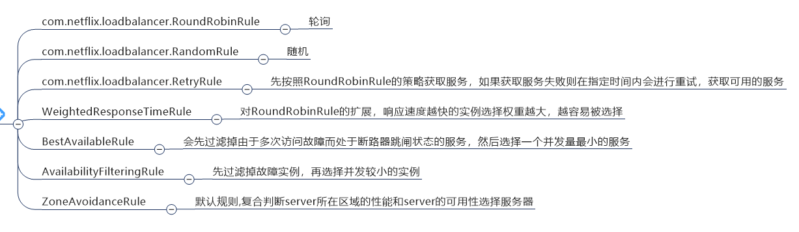
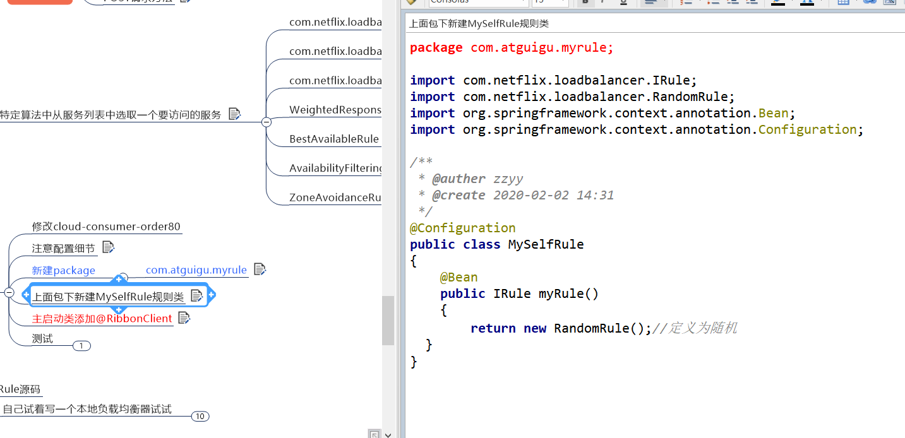
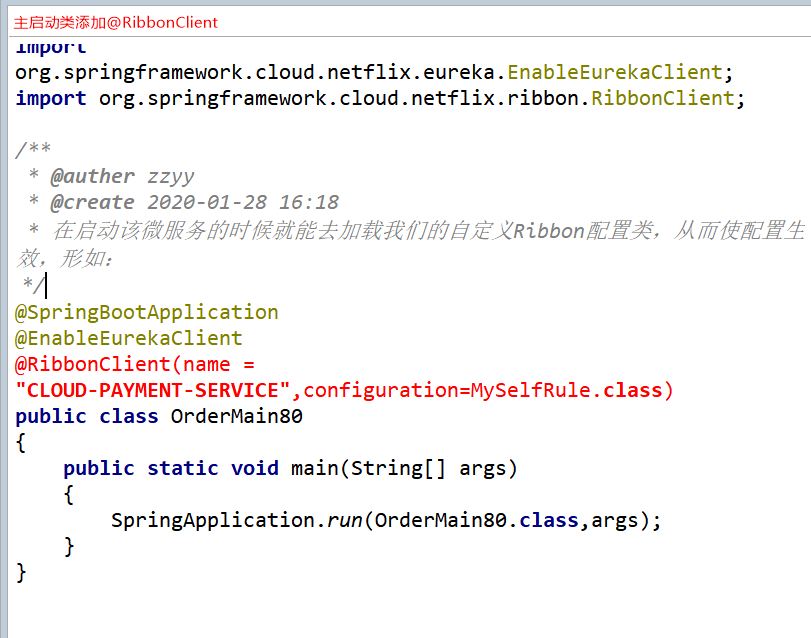

常见的负载均衡有软件Nginx，LVS，硬件 F5等。

Ribbon本地负载均衡客户端 VS Nginx服务端负载均衡区别
---

Nginx是服务器负载均衡，客户端所有请求都会交给nginx，

然后由nginx实现转发请求。即负载均衡是由服务端实现的。

Ribbon本地负载均衡，在调用微服务接口时候，

会在注册中心上获取注册信息服务列表之后缓存到JVM本地，

从而在本地实现RPC远程服务调用技术。

集中式负载均衡和进程内负载均衡
---

集中式LB

即在服务的消费方和提供方之间使用独立的LB设施(可以是硬件，如F5, 也可以是软件，如nginx), 

由该设施负责把访问请求通过某种策略转发至服务的提供方；

进程内LB

将LB逻辑集成到消费方，消费方从服务注册中心获知有哪些地址可用，

然后自己再从这些地址中选择出一个合适的服务器。

Ribbon就属于进程内LB，它只是一个类库，

集成于消费方进程，消费方通过它来获取到服务提供方的地址。

IRule：根据特定算法中从服务列表中选取一个要访问的服务
---

如何替换ribbon的负载均衡算法
---

负载均衡算法：
---

rest接口第几次请求数 % 服务器集群总数量 = 实际调用服务器位置下标，

每次服务重启动后rest接口计数从1开始。

如：   
    
    List [0] instances = 127.0.0.1:8002
    List [1] instances = 127.0.0.1:8001

8001+ 8002 组合成为集群，它们共计2台机器，集群总数为2， 按照轮询算法原理：

当总请求数为1时： 1 % 2 =1 对应下标位置为1 ，则获得服务地址为127.0.0.1:8001

当总请求数位2时： 2 % 2 =0 对应下标位置为0 ，则获得服务地址为127.0.0.1:8002

当总请求数位3时： 3 % 2 =1 对应下标位置为1 ，则获得服务地址为127.0.0.1:8001

当总请求数位4时： 4 % 2 =0 对应下标位置为0 ，则获得服务地址为127.0.0.1:8002

如此类推......

