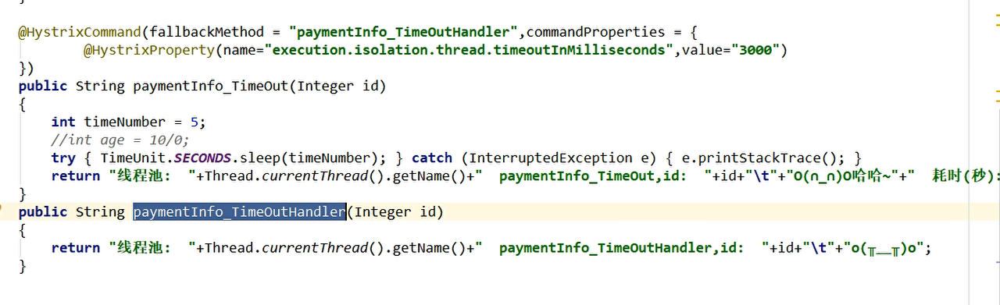
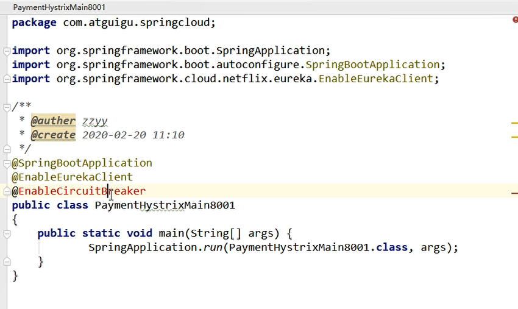
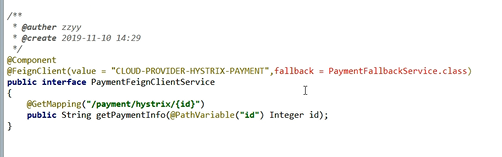
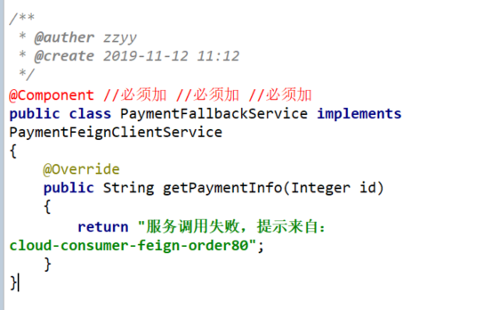

        <dependency>
            <groupId>org.springframework.cloud</groupId>
            <artifactId>spring-cloud-starter-netflix-hystrix</artifactId>
        </dependency>

服务降级
---

服务降级分为 调用方降级 被调用方降级 一般是调用方降级 你 

服务熔断
---

服务限流
---

Hystrix工作流程
---

1	创建 HystrixCommand（用在依赖的服务返回单个操作结果的时候） 或 HystrixObserableCommand（用在依赖的服务返回多个操作结果的时候） 对象。

2	命令执行。其中 HystrixComand 实现了下面前两种执行方式；而 HystrixObservableCommand 实现了后两种执行方式：execute()：同步执行，从依赖的服务返回一个单一的结果对象， 或是在发生错误的时候抛出异常。queue()：异步执行， 直接返回 一个Future对象， 其中包含了服务执行结束时要返回的单一结果对象。observe()：返回 Observable 对象，它代表了操作的多个结果，它是一个 Hot Obserable（不论 "事件源" 是否有 "订阅者"，都会在创建后对事件进行发布，所以对于 Hot Observable 的每一个 "订阅者" 都有可能是从 "事件源" 的中途开始的，并可能只是看到了整个操作的局部过程）。toObservable()： 同样会返回 Observable 对象，也代表了操作的多个结果，但它返回的是一个Cold Observable（没有 "订阅者" 的时候并不会发布事件，而是进行等待，直到有 "订阅者" 之后才发布事件，所以对于 Cold Observable 的订阅者，它可以保证从一开始看到整个操作的全部过程）。

3	若当前命令的请求缓存功能是被启用的， 并且该命令缓存命中， 那么缓存的结果会立即以 Observable 对象的形式 返回。

4	检查断路器是否为打开状态。如果断路器是打开的，那么Hystrix不会执行命令，而是转接到 fallback 处理逻辑（第 8 步）；如果断路器是关闭的，检查是否有可用资源来执行命令（第 5 步）。

5	线程池/请求队列/信号量是否占满。如果命令依赖服务的专有线程池和请求队列，或者信号量（不使用线程池的时候）已经被占满， 那么 Hystrix 也不会执行命令， 而是转接到 fallback 处理逻辑（第8步）。

6	Hystrix 会根据我们编写的方法来决定采取什么样的方式去请求依赖服务。HystrixCommand.run() ：返回一个单一的结果，或者抛出异常。HystrixObservableCommand.construct()： 返回一个Observable 对象来发射多个结果，或通过 onError 发送错误通知。

7	Hystrix会将 "成功"、"失败"、"拒绝"、"超时" 等信息报告给断路器， 而断路器会维护一组计数器来统计这些数据。断路器会使用这些统计数据来决定是否要将断路器打开，来对某个依赖服务的请求进行 "熔断/短路"。

8	当命令执行失败的时候， Hystrix 会进入 fallback 尝试回退处理， 我们通常也称该操作为 "服务降级"。而能够引起服务降级处理的情况有下面几种：第4步： 当前命令处于"熔断/短路"状态，断路器是打开的时候。第5步： 当前命令的线程池、 请求队列或 者信号量被占满的时候。第6步：HystrixObservableCommand.construct() 或 HystrixCommand.run() 抛出异常的时候。

9	当Hystrix命令执行成功之后， 它会将处理结果直接返回或是以Observable 的形式返回。

tips：如果我们没有为命令实现降级逻辑或者在降级处理逻辑中抛出了异常， Hystrix 依然会返回一个 Observable 对象， 但是它不会发射任何结果数据， 而是通过 onError 方法通知命令立即中断请求，并通过onError()方法将引起命令失败的异常发送给调用者。

@HystrixCommand
---

@DefaultProperties配置fallback
---

    @DefaultProperties(defaultFallback = "")

示例代码

    import com.atguigu.springcloud.service.PaymentHystrixService;
    import com.netflix.hystrix.contrib.javanica.annotation.DefaultProperties;
    import com.netflix.hystrix.contrib.javanica.annotation.HystrixCommand;
    import com.netflix.hystrix.contrib.javanica.annotation.HystrixProperty;
    import lombok.extern.slf4j.Slf4j;
    import org.springframework.web.bind.annotation.GetMapping;
    import org.springframework.web.bind.annotation.PathVariable;
    import org.springframework.web.bind.annotation.RestController;

    @RestController
    @Slf4j
    @DefaultProperties(defaultFallback = "payment_Global_FallbackMethod")
    public class PaymentHystirxController
    {
    @Resource
    private PaymentHystrixService paymentHystrixService;
    
        @GetMapping("/consumer/payment/hystrix/ok/{id}")
        public String paymentInfo_OK(@PathVariable("id") Integer id)
        {
            String result = paymentHystrixService.paymentInfo_OK(id);
            return result;
        }
    
        @GetMapping("/consumer/payment/hystrix/timeout/{id}")
        @HystrixCommand //加了@DefaultProperties属性注解，并且没有写具体方法名字，就用统一全局的
        public String paymentInfo_TimeOut(@PathVariable("id") Integer id)
        {
            String result = paymentHystrixService.paymentInfo_TimeOut(id);
            return result;
        }
        public String paymentTimeOutFallbackMethod(@PathVariable("id") Integer id)
        {
            return "paymentTimeOutFallbackMethod,对方系统繁忙，请10秒钟后再次尝试/(ㄒoㄒ)/";
        }
    
        public String payment_Global_FallbackMethod()
        {
            return "Global异常处理信息，请稍后再试，/(ㄒoㄒ)/~~";
        }
    }

@FeignClient的fallback
---

