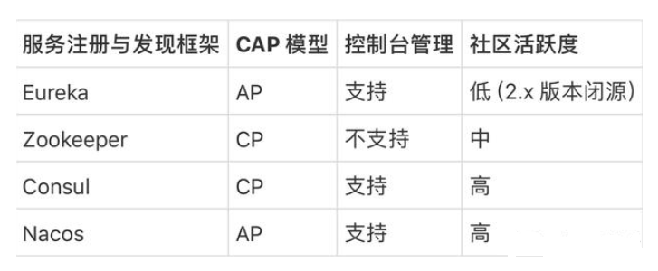
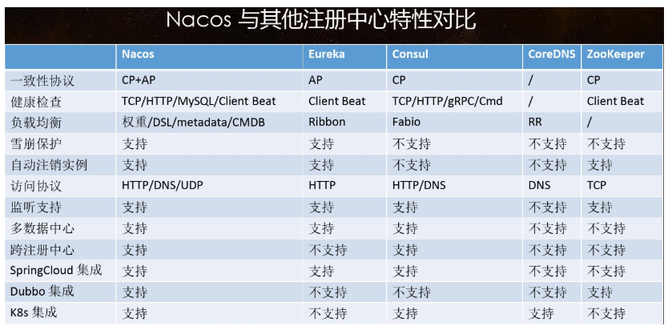
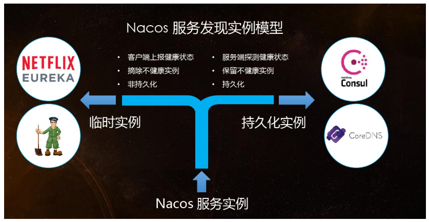
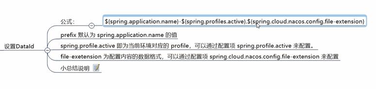
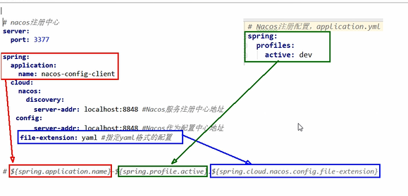
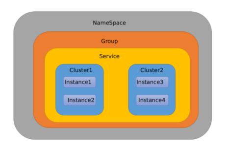
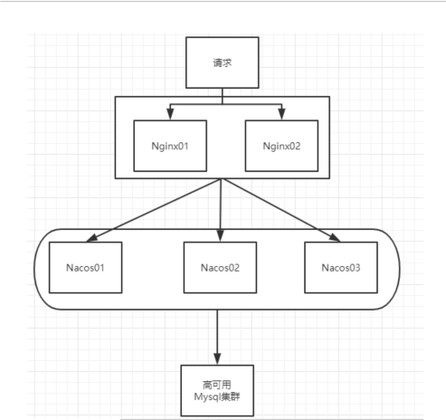

Nacos就是注册中心 + 配置中心的组合
---
替代Eureka做服务注册中心

替代Config做服务配置中心

解压安装包，直接运行bin目录下的startup.cmd

命令运行成功后直接访问http://localhost:8848/nacos

Nacos 支持AP和CP模式的切换
---

C是所有节点在同一时间看到的数据是一致的；而A的定义是所有的请求都会收到响应。

何时选择使用何种模式？
一般来说，
如果不需要存储服务级别的信息且服务实例是通过nacos-client注册，并能够保持心跳上报，那么就可以选择AP模式。当前主流的服务如 Spring cloud 和 Dubbo 服务，都适用于AP模式，AP模式为了服务的可能性而减弱了一致性，因此AP模式下只支持注册临时实例。

如果需要在服务级别编辑或者存储配置信息，那么 CP 是必须，K8S服务和DNS服务则适用于CP模式。
CP模式下则支持注册持久化实例，此时则是以 Raft 协议为集群运行模式，该模式下注册实例之前必须先注册服务，如果服务不存在，则会返回错误。

curl -X PUT '$NACOS_SERVER:8848/nacos/v1/ns/operator/switches?entry=serverMode&value=CP'

@RefreshScope
---

在类上才可以实现对象属性的的动态更新

设置DataId
---

Namespace+Group+Data ID三者关系？为什么这么设计？
---

1 是什么

    类似Java里面的package名和类名
    最外层的namespace是可以用于区分部署环境的，Group和DataID逻辑上区分两个目标对象。

2 三者情况

    默认情况：
    Namespace=public，Group=DEFAULT_GROUP, 默认Cluster是DEFAULT
    
    Nacos默认的命名空间是public，Namespace主要用来实现隔离。
    比方说我们现在有三个环境：开发、测试、生产环境，我们就可以创建三个Namespace，不同的Namespace之间是隔离的。
    
    Group默认是DEFAULT_GROUP，Group可以把不同的微服务划分到同一个分组里面去
    
    Service就是微服务；一个Service可以包含多个Cluster（集群），Nacos默认Cluster是DEFAULT，Cluster是对指定微服务的一个虚拟划分。
    比方说为了容灾，将Service微服务分别部署在了杭州机房和广州机房，
    这时就可以给杭州机房的Service微服务起一个集群名称（HZ），
    给广州机房的Service微服务起一个集群名称（GZ），还可以尽量让同一个机房的微服务互相调用，以提升性能。
    
    最后是Instance，就是微服务的实例。

Nacos集群架构
---

Nacos默认自带的是嵌入式数据库derby

 
