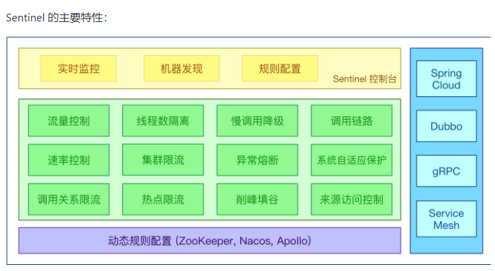
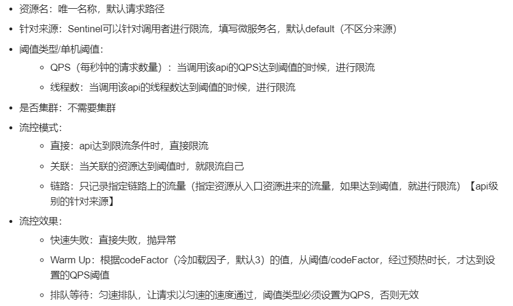
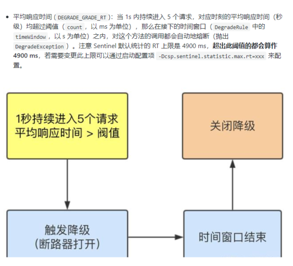
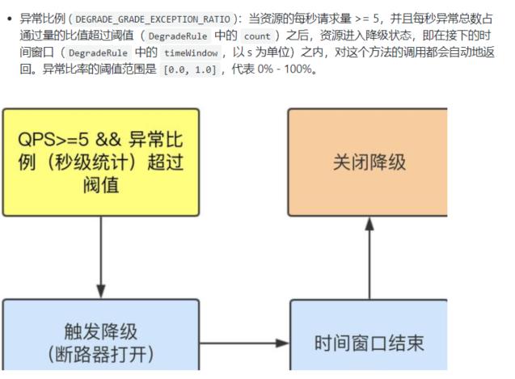
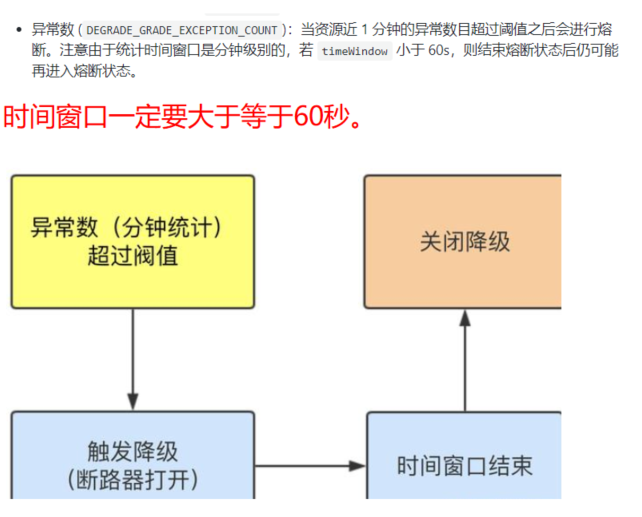

Sentinel主要特性
---

流控规则
---

熔断
---

Sentinel 熔断降级会在调用链路中某个资源出现不稳定状态时（例如调用超时或异常比例升高），对这个资源的调用进行限制，
让请求快速失败，避免影响到其它的资源而导致级联错误。

当资源被降级后，在接下来的降级时间窗口之内，对该资源的调用都自动熔断（默认行为是抛出 DegradeException）。

RT（平均响应时间）
---

异常比例
---

异常数
---

