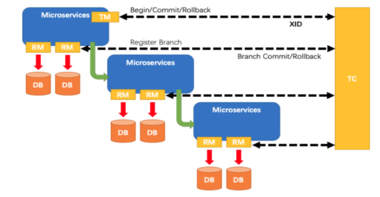
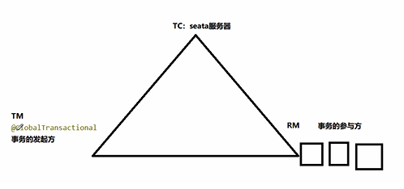
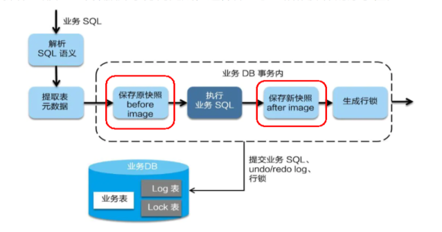
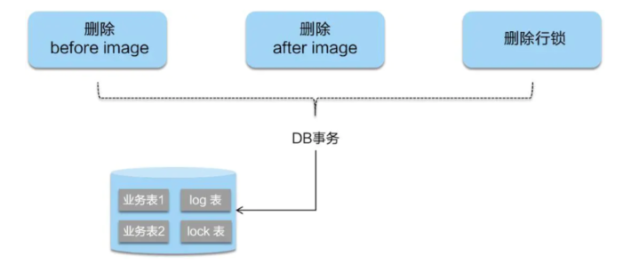
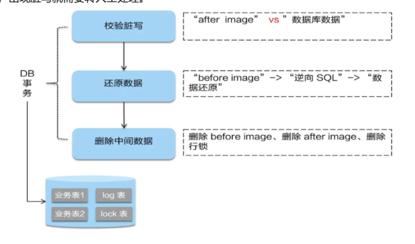

分布式事务处理过程的一ID+三组件模型
---

Transaction ID XID

Transaction Coordinator (TC)

    事务协调器，维护全局事务的运行状态，负责协调并驱动全局事务的提交或回滚；

Transaction Manager (TM)

    控制全局事务的边界，负责开启一个全局事务，并最终发起全局提交或全局回滚的决议；

Resource Manager (RM)

    控制分支事务，负责分支注册、状态汇报，并接收事务协调器的指令，驱动分支（本地）事务的提交和回滚

处理过程
---

TM 向 TC 申请开启一个全局事务，全局事务创建成功并生成一个全局唯一的 XID；
XID 在微服务调用链路的上下文中传播；
RM 向 TC 注册分支事务，将其纳入 XID 对应全局事务的管辖；
TM 向 TC 发起针对 XID 的全局提交或回滚决议；
TC 调度 XID 下管辖的全部分支事务完成提交或回滚请求。

工作原理
---

TC seata服务器

TM @GlobalTransactional

RM 事务的参与方（数据库）

TM 开启分布式事务（TM 向 TC 注册全局事务记录）；

按业务场景，编排数据库、服务等事务内资源（RM 向 TC 汇报资源准备状态 ）；

TM 结束分布式事务，事务一阶段结束（TM 通知 TC 提交/回滚分布式事务）；

TC 汇总事务信息，决定分布式事务是提交还是回滚；

TC 通知所有 RM 提交/回滚 资源，事务二阶段结束。 

AT模式如何做到对业务的无侵入
---

一阶段加载

    在一阶段，Seata 会拦截“业务 SQL”，
    1  解析 SQL 语义，找到“业务 SQL”要更新的业务数据，在业务数据被更新前，将其保存成“before image”，
    2  执行“业务 SQL”更新业务数据，在业务数据更新之后，
    3  其保存成“after image”，最后生成行锁。
    以上操作全部在一个数据库事务内完成，这样保证了一阶段操作的原子性。

二阶段提交

    二阶段如是顺利提交的话，    
    因为“业务 SQL”在一阶段已经提交至数据库，所以Seata框架只需将一阶段保存的快照数据和行锁删掉，完成数据清理即可。

二阶段回滚

    二阶段如果是回滚的话，Seata 就需要回滚一阶段已经执行的“业务 SQL”，还原业务数据。
    回滚方式便是用“before image”还原业务数据；但在还原前要首先要校验脏写，对比“数据库当前业务数据”和 “after image”，
    如果两份数据完全一致就说明没有脏写，可以还原业务数据，如果不一致就说明有脏写，出现脏写就需要转人工处理。

