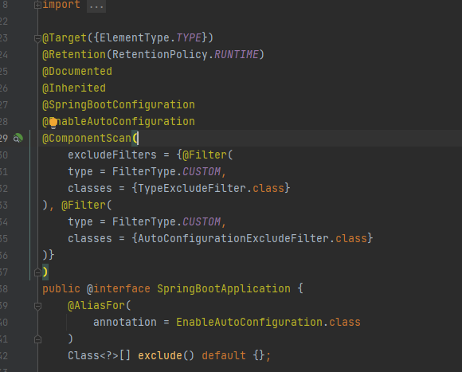
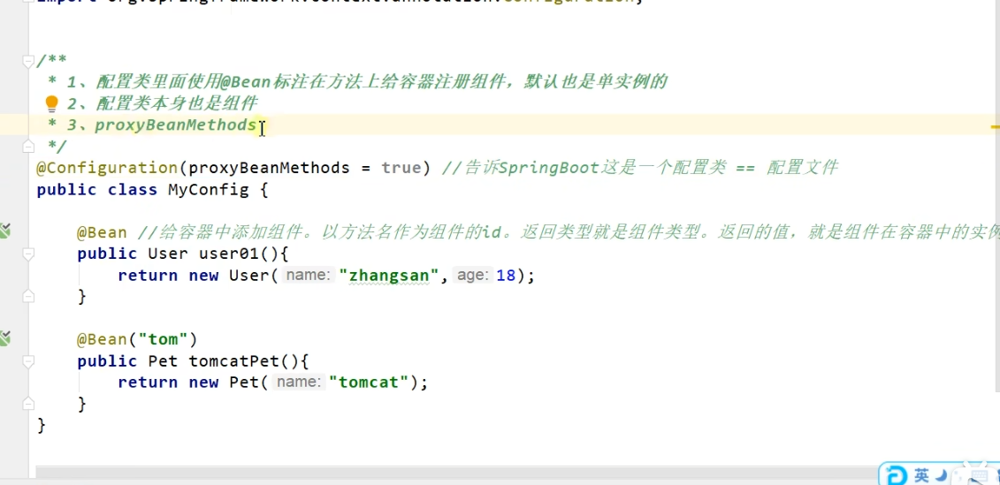
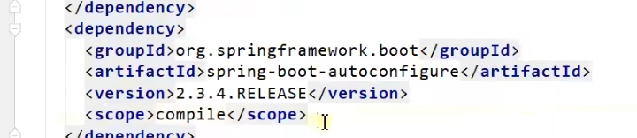

@SpringBootApplication这一个注解内包含了下面三个注解

    @SpringBootApplication
    等同于
    @SpringBootConfiguration
    @EnableAutoConfiguration
    @ComponentScan("com.lun")

spring boot 所有的自动配置功能 都在 spring-boot-configuration

@Configuration
---

在spring boot 2.0后多了个注解 @Configuration 多了 proxyBeanMethods

proxyBeanMethods如果是true SpringBoot总会检查这个组件MyConfig是否在容器中有 保持组件单实例

    /**
    * 1、配置类里面使用@Bean标注在方法上给容器注册组件，默认也是单实例的
    * 2、配置类本身也是组件
    * 3、proxyBeanMethods：代理bean的方法
    *      Full(proxyBeanMethods = true)（保证每个@Bean方法被调用多少次返回的组件都是单实例的）（默认）
    *      Lite(proxyBeanMethods = false)（每个@Bean方法被调用多少次返回的组件都是新创建的）
    */
    @Configuration(proxyBeanMethods = false) //告诉SpringBoot这是一个配置类 == 配置文件
    public class MyConfig {
    
        /**
         * Full:外部无论对配置类中的这个组件注册方法调用多少次获取的都是之前注册容器中的单实例对象
         * @return
         */
        @Bean //给容器中添加组件。以方法名作为组件的id。返回类型就是组件类型。返回的值，就是组件在容器中的实例
        public User user01(){
            User zhangsan = new User("zhangsan", 18);
            //user组件依赖了Pet组件
            zhangsan.setPet(tomcatPet());
            return zhangsan;
        }
    
        @Bean("tom")
        public Pet tomcatPet(){
            return new Pet("tomcat");
        }
    }

@Configuration如果是false 就不是代理对象 

    @SpringBootConfiguration
    @EnableAutoConfiguration
    @ComponentScan("com.atguigu.boot")
    public class MainApplication {
    
        public static void main(String[] args) {
        //1、返回我们IOC容器
            ConfigurableApplicationContext run = SpringApplication.run(MainApplication.class, args);
    
        //2、查看容器里面的组件
            String[] names = run.getBeanDefinitionNames();
            for (String name : names) {
                System.out.println(name);
            }
    
        //3、从容器中获取组件
            Pet tom01 = run.getBean("tom", Pet.class);
            Pet tom02 = run.getBean("tom", Pet.class);
            System.out.println("组件："+(tom01 == tom02));
    
        //4、com.atguigu.boot.config.MyConfig$$EnhancerBySpringCGLIB$$51f1e1ca@1654a892
            MyConfig bean = run.getBean(MyConfig.class);
            System.out.println(bean);
    
        //如果@Configuration(proxyBeanMethods = true)代理对象调用方法。SpringBoot总会检查这个组件是否在容器中有。
            //保持组件单实例
            User user = bean.user01();
            User user1 = bean.user01();
            System.out.println(user == user1);
    
            User user01 = run.getBean("user01", User.class);
            Pet tom = run.getBean("tom", Pet.class);
    
            System.out.println("用户的宠物："+(user01.getPet() == tom));
        }
    }

Full(proxyBeanMethods = true)（保证每个@Bean方法被调用多少次返回的组件都是单实例的）（默认）

Lite(proxyBeanMethods = false)（每个@Bean方法被调用多少次返回的组件都是新创建的）