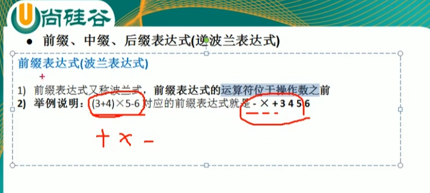
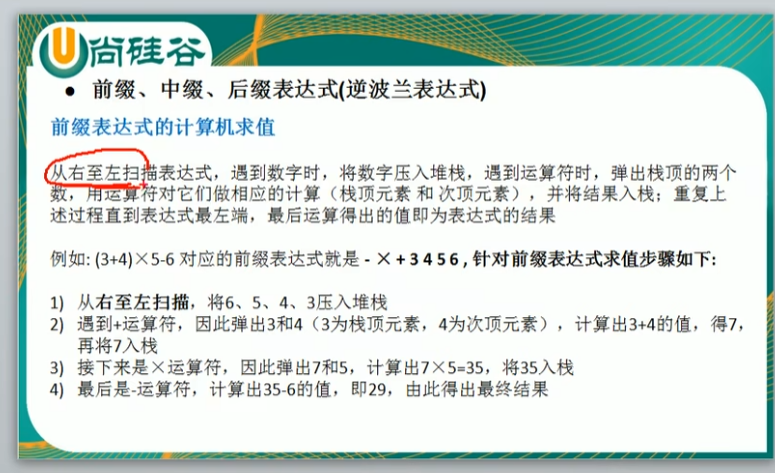
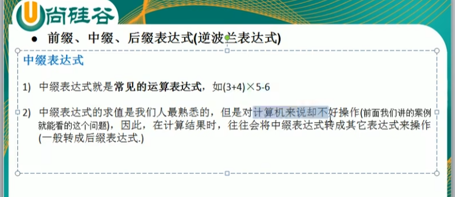
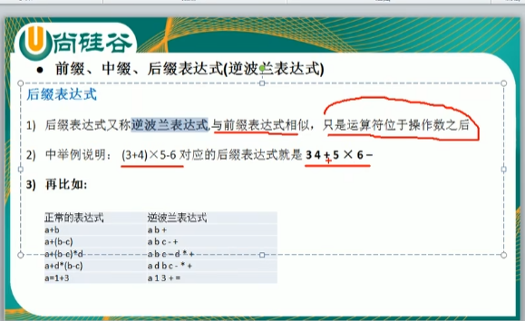
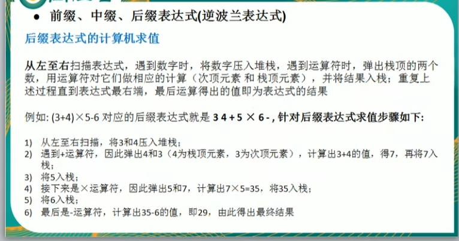
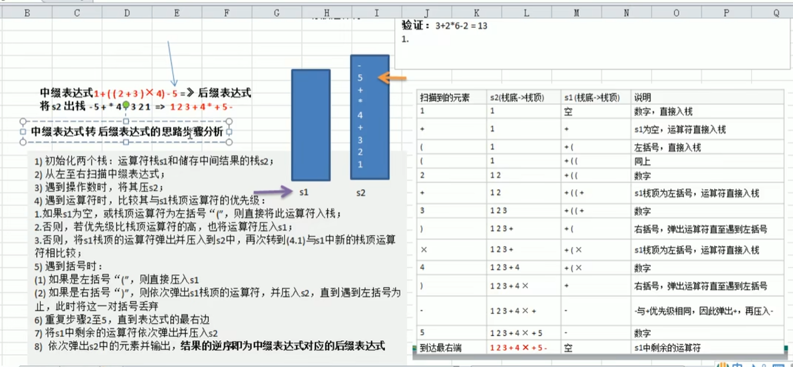

前缀表达式（波兰表达式）
---

运算符在操作数之前

从右到左扫描 遇到数字 入栈， 遇到运算符 弹出栈顶的两个数运算（前缀是栈顶元素和次顶元素进行运算）， 结果入栈

(3+4)*5-6  对应 -* + 3 4 5 6

 

中缀表达式
---

后缀表达式（逆波兰表达式）
---

从左到右扫描 遇到数字 入栈， 遇到运算符 弹出栈顶的两个数运算（前缀是次顶元素和栈顶元素进行运算）， 结果入栈

（3+4）*5-6 

中缀表达式转后缀表达式
---

