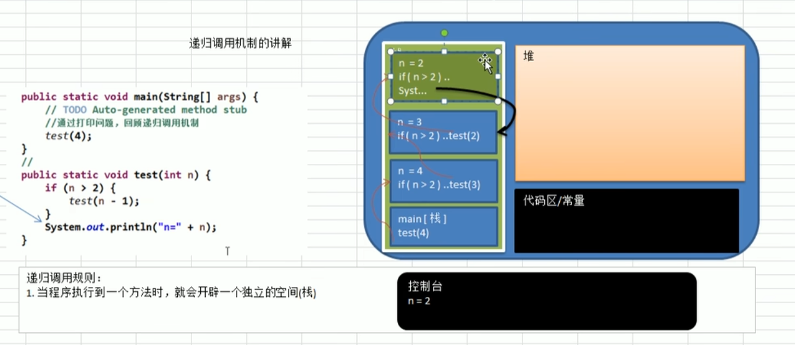

如果说加上else 只会打印n=2

阶乘问题

递归调用规则

    当一个程序执行到一个方法时，就会开辟一个独立的空间（栈）

    每个空间的数据（局部变量） 是独立的

递归需要遵守的重要原则

    执行一个方法时，就创建一个新的受保护的独立空间（栈空间）

    方法的局部变量是独立的 不会相互影响

    如果方法中使用的是引用类型变量（比如数组） 就会共享该引用类型的变量

    递归必须想退出递归的条件逼近 否则就是无限递归

    当一个方法执行完毕 或者遇到return 就会返回 遵守谁调用

    就将结果返回给谁 同时当方法执行完毕或者返回时 该方法也就执行完毕

迷宫问题
---
